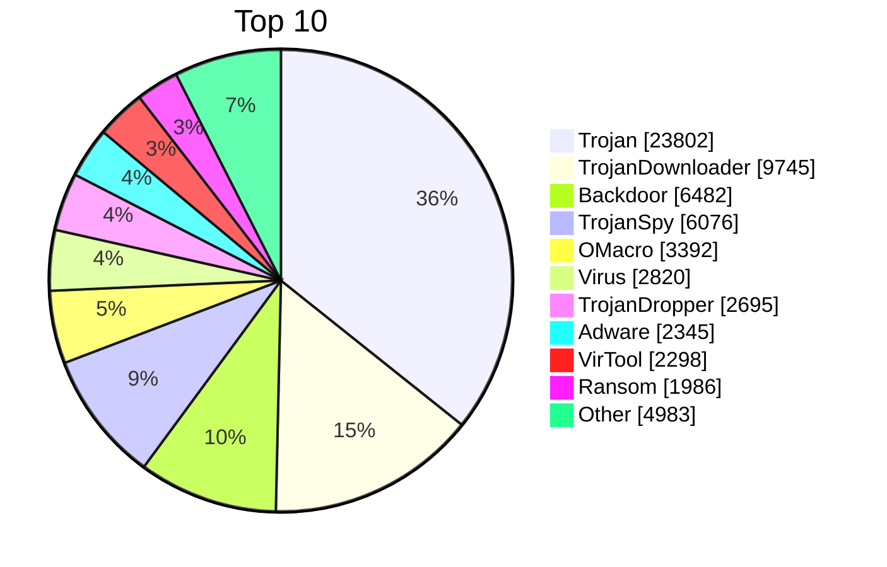

# 火绒病毒库更新日志

本仓库跟踪[火绒安全软件](https://www.huorong.cn/)病毒库的变更，通过读取`pset.db,troj.db,hwl.db,behav.db,crithash.db`自动生成与上一版本相比新增的特征项/报毒名, 黑名单哈希和白名单哈希。

> **免责声明**：本项目非火绒官方出品，仅供学习和技术交流使用。作者不对使用本项目造成的任何后果负责。

## 概览

- **最新版本**: `1768128066` (2026-01-11 10:41:06 UTC)
- **特征项总数**: 66,624
- **关键哈希特征项总数**: 80,501
- **行为特征项总数**: 904
- **黑名单哈希总数**: 187,382
- **白名单哈希总数**: 141,859
- **已跟踪版本数**: 18

## 特征项分类分布




---

## 更新日志

<details>
<summary><b>1768128066</b> - 2026-01-11 10:41:06 UTC</summary>

#### 黑名单哈希变更 ([troj.txt](data/1768128066.troj.txt))

新增: 35

#### 白名单哈希变更 ([hwl.txt](data/1768128066.hwl.txt))

新增: 12

</details>

<details>
<summary><b>1768044761</b> - 2026-01-10 11:32:41 UTC</summary>

#### 黑名单哈希变更 ([troj.txt](data/1768044761.troj.txt))

新增: 128

#### 白名单哈希变更 ([hwl.txt](data/1768044761.hwl.txt))

新增: 8

</details>

<details>
<summary><b>1767957379</b> - 2026-01-09 11:16:19 UTC</summary>

#### 特征项变更 ([pset.txt](data/1767957379.pset.txt))

<details>
<summary>
新增正式定义: 35
</summary>

```
[+] Backdoor/Agent.rb
[+] Backdoor/Lotok.oa
[+] Backdoor/Python.Agent.n
[+] Backdoor/Remcos.ax
[+] Exploit/HTML.CVE-2025-54100
[+] HVM:Backdoor/Lotok.cd
[+] HVM:TrojanDropper/W64.Agent.ca
[+] HackTool/Rdp2Tcp.a
[+] Trojan/AutoIt.Runner.g
[+] Trojan/Barys.c
[+] Trojan/FakeApp.aar
[+] Trojan/FakeApp.abj
[+] Trojan/FakeApp.abk
[+] Trojan/HTML.Phishing.hd
[+] Trojan/MSIL.CoinStealer.g
[+] Trojan/MSIL.Obfuscated.jw
[+] Trojan/PS.Loader.m
[+] Trojan/ShellLoader.ahf
[+] Trojan/StrongPity.c
[+] Trojan/W64.Agent.gj
[+] TrojanDownloader/Agent.blp
[+] TrojanDownloader/HTML.Agent.bg
[+] TrojanDownloader/MSIL.Agent.ajj
[+] TrojanDownloader/VBS.Agent.kc
[+] TrojanDropper/Agent.akb
[+] TrojanDropper/Agent.akl
[+] TrojanDropper/Agent.akm
[+] TrojanDropper/Agent.akp
[+] TrojanDropper/Agent.akq
[+] TrojanDropper/Agent.akr
[+] TrojanDropper/Agent.aks
[+] TrojanDropper/Agent.akt
[+] TrojanSpy/Banker.hm
[+] TrojanSpy/Zbot.dj
[+] Worm/Autorun.hc
```

</details>

<details>
<summary>
新增遥测定义: 41 | 移除遥测定义: 36
</summary>

```
[+] Backdoor/Agent.rc!submit
[+] Backdoor/CobaltStrike.oz!submit
[+] Backdoor/Ghost.ca!submit
[+] Backdoor/Linux.Lotok.a!submit
[+] Backdoor/Linux.Mirai.kw!submit
[+] Backdoor/Lotok.od!submit
[+] Backdoor/Lotok.oe!submit
[+] Backdoor/Lotok.of!submit
[+] Backdoor/Lotok.og!submit
[+] Backdoor/Lotok.oh!submit
[+] HEUR:Worm/BAT.Autorun.f!submit
[+] HackTool/Linux.BotWarden.a!submit
[+] Ransom/Cerber.ak!submit
[+] Rootkit/Agent!submit
[+] Trojan/Agent.clq!submit
[+] Trojan/DLLHijack.y!submit
[+] Trojan/FakeApp.abl!submit
[+] Trojan/GenCBL.a!submit
[+] Trojan/GenCBL.b!submit
[+] Trojan/HTML.Phishing.he!submit
[+] Trojan/Injector.clh!submit
[+] Trojan/Injector.cli!submit
[+] Trojan/Linux.Gafgyt.r!submit
[+] Trojan/Loader.ms!submit
[+] Trojan/MSIL.Obfuscated.jx!submit
[+] Trojan/Obfuscated.nt!submit
[+] Trojan/Obfuscated.nu!submit
[+] Trojan/PS.Runner.u!submit
[+] Trojan/ShellLoader.ahg!submit
[+] Trojan/ShellLoader.ahh!submit
[+] TrojanDownloader/Agent.blq!submit
[+] TrojanDownloader/Agent.bls!submit
[+] TrojanDownloader/HTML.Agent.bh!submit
[+] TrojanDownloader/JS.Agent.if!submit
[+] TrojanDownloader/Linux.Agent.du!submit
[+] TrojanDownloader/VBS.Agent.kd!submit
[+] TrojanDownloader/W64.Agent.co!submit
[+] TrojanSpy/JS.Stealer.bh!submit
[+] TrojanSpy/MSIL.Formbook.bd!submit
[+] TrojanSpy/MSIL.Formbook.be!submit
[+] TrojanSpy/MSIL.Formbook.bf!submit
[-] Backdoor/Agent.rb!submit
[-] Backdoor/Lotok.oa!submit
[-] Backdoor/Python.Agent.n!submit
[-] Backdoor/Remcos.ax!submit
[-] Exploit/HTML.CVE-2025-54100.a!submit
[-] HVM:Backdoor/Lotok.cd!submit
[-] HVM:TrojanDropper/W64.Agent.ca!submit
[-] HackTool/Rdp2Tcp.a!submit
[-] Trojan/AutoIt.Runner.g!submit
[-] Trojan/Barys.c!submit
[-] Trojan/FakeApp.aar!submit
[-] Trojan/FakeApp.abb!submit
[-] Trojan/FakeApp.abj!submit
[-] Trojan/FakeApp.abk!submit
[-] Trojan/HTML.Phishing.hd!submit
[-] Trojan/MSIL.CoinStealer.g!submit
[-] Trojan/MSIL.Obfuscated.jw!submit
[-] Trojan/PS.Loader.m!submit
[-] Trojan/ShellLoader.ahf!submit
[-] Trojan/StrongPity.c!submit
[-] Trojan/W64.Agent.gj!submit
[-] TrojanDownloader/Agent.blp!submit
[-] TrojanDownloader/HTML.Agent.bg!submit
[-] TrojanDownloader/MSIL.Agent.ajj!submit
[-] TrojanDownloader/VBS.Agent.kc!submit
[-] TrojanDropper/Agent.akb!submit
[-] TrojanDropper/Agent.akl!submit
[-] TrojanDropper/Agent.akm!submit
[-] TrojanDropper/Agent.akp!submit
[-] TrojanDropper/Agent.akq!submit
[-] TrojanDropper/Agent.akr!submit
[-] TrojanDropper/Agent.aks!submit
[-] TrojanDropper/Agent.akt!submit
[-] TrojanSpy/Banker.hm!submit
[-] TrojanSpy/Zbot.dj!submit
[-] Worm/Autorun.hc!submit
```

</details>

#### 关键哈希特征项变更 ([crithash.txt](data/1767957379.crithash.txt))

<details>
<summary>
新增正式定义: 17 | 移除正式定义: 1
</summary>

```
[+] Backdoor/W32.Agent.e!crit
[+] Backdoor/W32.Lotok.af!crit
[+] Trojan/MSIL.Agent.aak!crit
[+] Trojan/MSIL.Obfuscated.an!crit
[+] Trojan/MSIL.Obfuscated.jw!crit
[+] Trojan/SCR.Agent.c!crit
[+] Trojan/SCR.Agent.d!crit
[+] Trojan/W32.FakeApp.e!crit
[+] Trojan/W32.Obfuscated.nv!crit
[+] Trojan/W32.Obfuscated.nw!crit
[+] Trojan/W64.KillWin.dj!crit
[+] TrojanDownloader/W32.Agent.blp!crit
[+] TrojanDropper/W32.Agent.m!crit
[+] TrojanSpy/MSIL.Formbook.a!crit
[+] Worm/SCR.Autorun.a!crit
[+] Worm/VBS.Capside.a!crit
[+] Worm/W32.Capside.a!crit
[-] Virus/MAYA.FuckVirus.b!crit
```

</details>

<details>
<summary>
新增遥测定义: 35 | 移除遥测定义: 19
</summary>

```
[+] Backdoor/OSX.NukeSped.a!crit!submit
[+] Backdoor/PHP.Webshell.p!crit!submit
[+] Backdoor/PHP.Webshell.q!crit!submit
[+] Backdoor/PHP.Webshell.r!crit!submit
[+] Backdoor/PS.GuidPuller.b!crit!submit
[+] Backdoor/W32.Lotok.u!crit!submit
[+] Backdoor/W32.Lotok.v!crit!submit
[+] HackTool/Linux.Usurper.a!crit!submit
[+] Trojan/BAT.KillAV.c!crit!submit
[+] Trojan/BAT.KillAV.d!crit!submit
[+] Trojan/MSIL.Injector.g!crit!submit
[+] Trojan/Python.Agent.bt!crit!submit
[+] Trojan/SCR.ShellCode.e!crit!submit
[+] Trojan/SCR.ShellCode.f!crit!submit
[+] Trojan/W32.Injector.clh!crit!submit
[+] Trojan/W32.ShellLoader.l!crit!submit
[+] TrojanDownloader/JS.Agent.c!crit!submit
[+] TrojanDownloader/MSIL.Runner.a!crit!submit
[+] TrojanDownloader/MSIL.Runner.b!crit!submit
[+] TrojanDownloader/PS.Runner.h!crit!submit
[+] TrojanDownloader/PS.Runner.i!crit!submit
[+] TrojanDownloader/PS.Runner.j!crit!submit
[+] TrojanDownloader/PS.Runner.k!crit!submit
[+] TrojanDownloader/PS.Runner.l!crit!submit
[+] TrojanDownloader/PS.Runner.m!crit!submit
[+] TrojanDownloader/PS.Runner.n!crit!submit
[+] TrojanDownloader/PS.Runner.o!crit!submit
[+] TrojanDownloader/W32.Runner.c!crit!submit
[+] TrojanDownloader/W32.Runner.d!crit!submit
[+] TrojanDropper/PS.ShellLoader.c!crit!submit
[+] TrojanDropper/VBS.Runner.b!crit!submit
[+] TrojanDropper/W64.ShellLoader.b!crit!submit
[+] TrojanSpy/MSIL.Stealer.ccz!crit!submit
[+] TrojanSpy/MSIL.Stealer.cda!crit!submit
[+] Worm/BAT.Runner.bp!crit!submit
[-] Backdoor/W32.Agent.e!crit!submit
[-] Backdoor/W32.Lotok.af!crit!submit
[-] Backdoor/W32.Lotok.ag!crit!submit
[-] Trojan/MSIL.Agent.aak!crit!submit
[-] Trojan/MSIL.Obfuscated.an!crit!submit
[-] Trojan/MSIL.Obfuscated.jw!crit!submit
[-] Trojan/SCR.Agent.c!crit!submit
[-] Trojan/SCR.Agent.d!crit!submit
[-] Trojan/W32.FakeApp.e!crit!submit
[-] Trojan/W32.Obfuscated.nv!crit!submit
[-] Trojan/W32.Obfuscated.nw!crit!submit
[-] Trojan/W32.ShellLoader.k!crit!submit
[-] Trojan/W64.KillWin.dj!crit!submit
[-] TrojanDownloader/W32.Agent.blp!crit!submit
[-] TrojanDroppper/VBS.Runner.a!crit!submit
[-] TrojanSpy/MSIL.Formbook.a!crit!submit
[-] Worm/SCR.Autorun.a!crit!submit
[-] Worm/VBS.Capside.a!crit!submit
[-] Worm/W32.Capside.a!crit!submit
```

</details>

#### 行为特征项变更 ([behav.txt](data/1767957379.behav.txt))

<details>
<summary>
新增: 2 | 移除: 2
</summary>

```
[+] ADV:Ransom/Genalocker.ZEA!submit
[+] ADV:Ransom/Genalocker.ZEB!submit
[-] ADV:Ransom/Genalocker.ZCB!submit
[-] ADV:Ransom/Genalocker.ZDA!submit
```

</details>

#### 黑名单哈希变更 ([troj.txt](data/1767957379.troj.txt))

新增: 137 | 移除: 2

</details>

<details>
<summary><b>1767870070</b> - 2026-01-08 11:01:10 UTC</summary>

#### 特征项变更 ([pset.txt](data/1767870070.pset.txt))

<details>
<summary>
新增正式定义: 42 | 移除正式定义: 1
</summary>

```
[+] Backdoor/Lotok.ob
[+] Backdoor/W64.AdaptixC2.b
[+] Backdoor/W64.Agent.l
[+] Backdoor/W64.Agent.m
[+] HEUR:Backdoor/MSIL.Bladabindi.bc
[+] HEUR:Backdoor/MSIL.Bladabindi.bd
[+] HEUR:Trojan/Injector.cp
[+] HVM:Backdoor/Lotok.bx
[+] HackTool/Python.Winpwnage.a
[+] Ransom/LockFile.ri
[+] Trojan/Agent.clp
[+] Trojan/BAT.Loader.j
[+] Trojan/FakeApp.abg
[+] Trojan/FakeApp.abh
[+] Trojan/FakeApp.abi
[+] Trojan/Linux.Mirai.gg
[+] Trojan/Linux.Mirai.gh
[+] Trojan/Loader.mq
[+] Trojan/Loader.mr
[+] Trojan/Obfuscated.ns
[+] Trojan/Python.DDos.h
[+] Trojan/ShellLoader.ahd
[+] Trojan/ShellLoader.ahe
[+] TrojanDownloader/PS.Agent.fa
[+] TrojanDownloader/PS.Agent.fb
[+] TrojanDownloader/VBS.Agent.kb
[+] TrojanDownloader/W64.Agent.cn
[+] TrojanDropper/Agent.akk
[+] TrojanDropper/Agent.akn
[+] TrojanDropper/Agent.ako
[+] TrojanDropper/MSIL.Agent.jx
[+] TrojanDropper/Python.Agent.n
[+] TrojanDropper/VBS.Agent.ef
[+] TrojanDropper/W64.Agent.bz
[+] TrojanSpy/HTML.Stealer.c
[+] TrojanSpy/Python.Rodico.a
[+] VirTool/Obfuscator.aw
[+] VirTool/Obfuscator.ay
[+] VirTool/Obfuscator.ba
[+] VirTool/Obfuscator.bb
[+] VirTool/Obfuscator.be
[+] VirTool/Obfuscator.db
[-] Backdoor/W64.AdaptixC2.a
```

</details>

<details>
<summary>
新增遥测定义: 33 | 移除遥测定义: 43
</summary>

```
[+] Backdoor/Agent.rb!submit
[+] Backdoor/Lotok.oa!submit
[+] Backdoor/Lotok.oc!submit
[+] Backdoor/Python.Agent.n!submit
[+] Backdoor/Remcos.ax!submit
[+] Exploit/HTML.CVE-2025-54100.a!submit
[+] HEUR:TrojanDropper/Agent.ar!submit
[+] HVM:Backdoor/Lotok.cd!submit
[+] HVM:TrojanDropper/W64.Agent.ca!submit
[+] HackTool/Rdp2Tcp.a!submit
[+] Trojan/AutoIt.Runner.g!submit
[+] Trojan/Barys.c!submit
[+] Trojan/FakeApp.abj!submit
[+] Trojan/FakeApp.abk!submit
[+] Trojan/HTML.Phishing.hd!submit
[+] Trojan/MSIL.CoinStealer.g!submit
[+] Trojan/MSIL.Obfuscated.jw!submit
[+] Trojan/PS.Loader.m!submit
[+] Trojan/ShellLoader.ahf!submit
[+] Trojan/StrongPity.c!submit
[+] Trojan/W64.Agent.gj!submit
[+] TrojanDownloader/Agent.blp!submit
[+] TrojanDownloader/HTML.Agent.bg!submit
[+] TrojanDownloader/MSIL.Agent.ajj!submit
[+] TrojanDownloader/VBS.Agent.kc!submit
[+] TrojanDropper/Agent.akp!submit
[+] TrojanDropper/Agent.akq!submit
[+] TrojanDropper/Agent.akr!submit
[+] TrojanDropper/Agent.aks!submit
[+] TrojanDropper/Agent.akt!submit
[+] TrojanSpy/Banker.hm!submit
[+] TrojanSpy/Zbot.dj!submit
[+] Worm/Autorun.hc!submit
[-] Backdoor/Lotok.ob!submit
[-] Backdoor/W64.AdaptixC2.b!submit
[-] Backdoor/W64.Agent.l!submit
[-] Backdoor/W64.Agent.m!submit
[-] HEUR:Backdoor/MSIL.Bladabindi.bc!submit
[-] HEUR:Backdoor/MSIL.Bladabindi.bd!submit
[-] HEUR:Trojan/BAT.Loader.j!submit
[-] HEUR:Trojan/Injector.cp!submit
[-] HEUR:Trojan/KillWin.dj!submit
[-] HVM:Backdoor/Lotok.bx!submit
[-] Ransom/LockFile.ri!submit
[-] Trojan/Agent.clp!submit
[-] Trojan/BAT.Loader.j!submit
[-] Trojan/FakeApp.abg!submit
[-] Trojan/FakeApp.abh!submit
[-] Trojan/FakeApp.abi!submit
[-] Trojan/Linux.Mirai.gg!submit
[-] Trojan/Linux.Mirai.gh!submit
[-] Trojan/Loader.mq!submit
[-] Trojan/Loader.mr!submit
[-] Trojan/Obfuscated.ns!submit
[-] Trojan/Python.DDos.h!submit
[-] Trojan/ShellLoader.ahd!submit
[-] Trojan/ShellLoader.ahe!submit
[-] TrojanDownloader/PS.Agent.fa!submit
[-] TrojanDownloader/PS.Agent.fb!submit
[-] TrojanDownloader/VBS.Agent.kb!submit
[-] TrojanDownloader/W64.Agent.cn!submit
[-] TrojanDropper/Agent.akk!submit
[-] TrojanDropper/Agent.akn!submit
[-] TrojanDropper/Agent.ako!submit
[-] TrojanDropper/MSIL.Agent.jx!submit
[-] TrojanDropper/Python.Agent.n!submit
[-] TrojanDropper/VBS.Agent.ef!submit
[-] TrojanDropper/W64.Agent.bz!submit
[-] TrojanSpy/HTML.Stealer.c!submit
[-] TrojanSpy/Python.Rodico.a!submit
[-] VirTool/Obfuscator.aw!submit
[-] VirTool/Obfuscator.ay!submit
[-] VirTool/Obfuscator.ba!submit
[-] VirTool/Obfuscator.bb!submit
[-] VirTool/Obfuscator.be!submit
[-] VirTool/Obfuscator.db!submit
```

</details>

#### 关键哈希特征项变更 ([crithash.txt](data/1767870070.crithash.txt))

<details>
<summary>
新增正式定义: 20
</summary>

```
[+] Adware/Android.PornTool.g!crit
[+] Adware/Android.PornTool.h!crit
[+] Adware/W32.Agent.da!crit
[+] Backdoor/Linux.Mirai.a!crit
[+] Backdoor/Linux.Mirai.b!crit
[+] Backdoor/Linux.ReverseShell.a!crit
[+] Backdoor/W64.Agent.g!crit
[+] Backdoor/W64.SparkRAT.a!crit
[+] Exploit/W32.CVE-2025-62215.a!crit
[+] HEUR:Trojan/W32.HiJack.a!crit
[+] HackTool/Linux.CoinMiner.a!crit
[+] Trojan/HTML.Phishing.oq!crit
[+] Trojan/MSIL.Obfuscated.am!crit
[+] Trojan/W32.Obfuscated.nt!crit
[+] TrojanDownloader/MSIL.Maloader.j!crit
[+] TrojanDownloader/VBS.Obfuscated.c!crit
[+] TrojanSpy/Linux.Stealer.b!crit
[+] TrojanSpy/W32.Rodico.a!crit
[+] TrojanSpy/W64.ClipBanker.b!crit
[+] Virus/MAYA.FuckVirus.b!crit
```

</details>

<details>
<summary>
新增遥测定义: 41 | 移除遥测定义: 19
</summary>

```
[+] Backdoor/PS.ReverseShell.d!crit!submit
[+] Backdoor/PS.ReverseShell.e!crit!submit
[+] Backdoor/W32.Agent.e!crit!submit
[+] Backdoor/W32.Lotok.af!crit!submit
[+] Backdoor/W32.Lotok.ag!crit!submit
[+] HEUR:Trojan/W32.HiJack.b!crit!submit
[+] Joke/MSIL.Agent.a!crit!submit
[+] Ransom/MSIL.LockFile.b!crit!submit
[+] Ransom/W64.LockFilet.a!crit!submit
[+] Trojan/MSIL.Agent.aak!crit!submit
[+] Trojan/MSIL.Injector.c!crit!submit
[+] Trojan/MSIL.Injector.d!crit!submit
[+] Trojan/MSIL.Injector.e!crit!submit
[+] Trojan/MSIL.Injector.f!crit!submit
[+] Trojan/MSIL.Obfuscated.an!crit!submit
[+] Trojan/MSIL.Obfuscated.jw!crit!submit
[+] Trojan/SCR.Agent.c!crit!submit
[+] Trojan/SCR.Agent.d!crit!submit
[+] Trojan/W32.FakeApp.e!crit!submit
[+] Trojan/W32.Injector.q!crit!submit
[+] Trojan/W32.Obfuscated.nv!crit!submit
[+] Trojan/W32.Obfuscated.nw!crit!submit
[+] Trojan/W32.ShellLoader.k!crit!submit
[+] Trojan/W64.KillWin.dj!crit!submit
[+] TrojanDownloader/BAT.Runner.e!crit!submit
[+] TrojanDownloader/BAT.Runner.f!crit!submit
[+] TrojanDownloader/PS.Runner.g!crit!submit
[+] TrojanDownloader/W32.Agent.blp!crit!submit
[+] TrojanDropper/MSIL.Agent.b!crit!submit
[+] TrojanDropper/MSIL.Agent.c!crit!submit
[+] TrojanDropper/MSIL.Agent.d!crit!submit
[+] TrojanDropper/W32.Agent.ah!crit!submit
[+] TrojanDropper/W32.DDoS.a!crit!submit
[+] TrojanDroppper/VBS.Runner.a!crit!submit
[+] TrojanSpy/MSIL.Formbook.a!crit!submit
[+] TrojanSpy/MSIL.Keylogger.b!crit!submit
[+] TrojanSpy/MSIL.Stealer.ccx!crit!submit
[+] TrojanSpy/MSIL.Stealer.ccy!crit!submit
[+] Worm/SCR.Autorun.a!crit!submit
[+] Worm/VBS.Capside.a!crit!submit
[+] Worm/W32.Capside.a!crit!submit
[-] Adware/Android.PornTool.g!crit!submit
[-] Adware/Android.PornTool.h!crit!submit
[-] Adware/W32.Agent.da!crit!submit
[-] Backdoor/Linux.Mirai.a!crit!submit
[-] Backdoor/Linux.Mirai.b!crit!submit
[-] Backdoor/Linux.ReverseShell.a!crit!submit
[-] Backdoor/W64.Agent.g!crit!submit
[-] Backdoor/W64.SparkRAT.a!crit!submit
[-] Exploit/W32.CVE-2025-62215.a!crit!submit
[-] HEUR:Trojan/W32.HiJack.a!crit!submit
[-] HackTool/Linux.CoinMiner.a!crit!submit
[-] Trojan/HTML.Phishing.oq!crit!submit
[-] Trojan/MSIL.Obfuscated.am!crit!submit
[-] Trojan/W32.Obfuscated.nt!crit!submit
[-] TrojanDownloader/MSIL.Maloader.j!crit!submit
[-] TrojanSpy/Linux.Stealer.b!crit!submit
[-] TrojanSpy/W32.Rodico.a!crit!submit
[-] TrojanSpy/W64.ClipBanker.b!crit!submit
[-] Virus/MAYA.FuckVirus.b!crit!submit
```

</details>

#### 行为特征项变更 ([behav.txt](data/1767870070.behav.txt))

<details>
<summary>
新增: 2 | 移除: 1
</summary>

```
[+] Backdoor/Lotok.DA!submit
[+] Software:GM/NN.A#NN加速器
[-] Software:GM/NN.A#NN加速器!submit
```

</details>

#### 黑名单哈希变更 ([troj.txt](data/1767870070.troj.txt))

新增: 64

</details>

<details>
<summary><b>1767782775</b> - 2026-01-07 10:46:15 UTC</summary>

#### 特征项变更 ([pset.txt](data/1767782775.pset.txt))

<details>
<summary>
新增正式定义: 77
</summary>

```
[+] Backdoor/Agent.ra
[+] Backdoor/Linux.Gafgyt.by
[+] Backdoor/Lotok.nz
[+] Backdoor/W64.Agent.k
[+] Backdoor/Xkcp.a
[+] Exploit/VulnDriver.s
[+] HEUR:Backdoor/Linux.Mirai.ku
[+] HEUR:Trojan/BAT.Loader.j
[+] HEUR:Trojan/BAT.Loader.k
[+] HEUR:Trojan/Injector.co
[+] HEUR:Trojan/JS.Obfuscated.db
[+] HEUR:Trojan/KillMBR.cm
[+] HEUR:Trojan/KillWin.f
[+] HEUR:Trojan/Runner.fm
[+] HEUR:TrojanDownloader/Agent.blo
[+] HEUR:TrojanDownloader/VBS.Agent.gc
[+] HVM:TrojanDropper/W64.Agent.bz
[+] Hacktool/ConnectWise
[+] Rootkit/W64.Agent.l
[+] Trojan/Agent.clo
[+] Trojan/BAT.Loader.i
[+] Trojan/BAT.Pwrsvc.bv
[+] Trojan/DDOS.ae
[+] Trojan/DLLHijack.x
[+] Trojan/DllHijack.x
[+] Trojan/FakeApp.aax
[+] Trojan/FakeApp.aay
[+] Trojan/FakeApp.aaz
[+] Trojan/FakeApp.aba
[+] Trojan/FakeApp.abc
[+] Trojan/FakeApp.abd
[+] Trojan/FakeApp.abe
[+] Trojan/FakeApp.abf
[+] Trojan/FakeApp.zi
[+] Trojan/HiJack.yj
[+] Trojan/JS.Obfuscated.da
[+] Trojan/KillAV.dc
[+] Trojan/Linux.Mirai.fq
[+] Trojan/Linux.Mirai.fv
[+] Trojan/Linux.Mirai.gc
[+] Trojan/Linux.Mirai.gd
[+] Trojan/Linux.Mirai.ge
[+] Trojan/Linux.Mirai.gf
[+] Trojan/Loader.mo
[+] Trojan/Loader.mp
[+] Trojan/MSIL.Injector.qg
[+] Trojan/MSIL.Obfuscated.jv
[+] Trojan/NSIS.Injector.f
[+] Trojan/Runner.fl
[+] Trojan/ShellLoader.aha
[+] Trojan/ShellLoader.ahb
[+] Trojan/ShellLoader.ahc
[+] Trojan/ShellcodeRunner.b
[+] Trojan/W64.Injector.bz
[+] Trojan/W64.Injector.ca
[+] TrojanDownloader/Agent.bln
[+] TrojanDownloader/Agent.blo
[+] TrojanDownloader/BAT.Agent.gb
[+] TrojanDownloader/Linux.Agent.dp
[+] TrojanDownloader/Linux.Mozi.c
[+] TrojanDownloader/Maloader.bn
[+] TrojanDropper/Agent.akf
[+] TrojanDropper/Agent.akg
[+] TrojanDropper/Agent.akh
[+] TrojanDropper/Agent.aki
[+] TrojanDropper/Agent.akj
[+] TrojanDropper/BAT.Agent.bm
[+] TrojanDropper/Maloader.m
[+] TrojanSpy/MSIL.ClipBanker.av
[+] TrojanSpy/Stealer.th
[+] TrojanSpy/W64.ClipBanker.e
[+] TrojanSpy/W64.PwStealer.d
[+] TrojanSpy/W64.Stealer.x
[+] Virus/MAYA.FuckVirus.a
[+] Worm/Autorun.ha
[+] Worm/Autorun.hb
[+] Worm/Phorpiex.o
```

</details>

<details>
<summary>
新增遥测定义: 47 | 移除遥测定义: 47
</summary>

```
[+] Backdoor/Lotok.ob!submit
[+] Backdoor/W64.Agent.l!submit
[+] Backdoor/W64.Agent.m!submit
[+] HEUR:Backdoor/MSIL.Bladabindi.bc!submit
[+] HEUR:Backdoor/MSIL.Bladabindi.bd!submit
[+] HEUR:Trojan/Injector.cp!submit
[+] HEUR:Trojan/JS.Agent.gr!submit
[+] HEUR:Trojan/KillWin.dj!submit
[+] HVM:Backdoor/Lotok.bx!submit
[+] HVM:Trojan/Injector.ah!submit
[+] HVM:Trojan/Injector.cn!submit
[+] HVM:Trojan/SelfDel.e!submit
[+] Ransom/LockFile.ri!submit
[+] Trojan/Agent.clp!submit
[+] Trojan/BAT.Loader.j!submit
[+] Trojan/FakeApp.aar!submit
[+] Trojan/FakeApp.abg!submit
[+] Trojan/FakeApp.abh!submit
[+] Trojan/FakeApp.abi!submit
[+] Trojan/Linux.Mirai.gg!submit
[+] Trojan/Linux.Mirai.gh!submit
[+] Trojan/Loader.mq!submit
[+] Trojan/Loader.mr!submit
[+] Trojan/Obfuscated.ns!submit
[+] Trojan/Python.DDos.h!submit
[+] Trojan/ShellLoader.ahd!submit
[+] Trojan/ShellLoader.ahe!submit
[+] TrojanDownloader/PS.Agent.fa!submit
[+] TrojanDownloader/PS.Agent.fb!submit
[+] TrojanDownloader/VBS.Agent.kb!submit
[+] TrojanDownloader/W64.Agent.cn!submit
[+] TrojanDropper/Agent.akk!submit
[+] TrojanDropper/Agent.akl!submit
[+] TrojanDropper/Agent.akm!submit
[+] TrojanDropper/Agent.akn!submit
[+] TrojanDropper/Agent.ako!submit
[+] TrojanDropper/MSIL.Agent.jx!submit
[+] TrojanDropper/Python.Agent.n!submit
[+] TrojanDropper/VBS.Agent.ef!submit
[+] TrojanDropper/W64.Agent.bz!submit
[+] TrojanSpy/Python.Rodico.a!submit
[+] VirTool/Obfuscator.aw!submit
[+] VirTool/Obfuscator.ay!submit
[+] VirTool/Obfuscator.ba!submit
[+] VirTool/Obfuscator.bb!submit
[+] VirTool/Obfuscator.be!submit
[+] VirTool/Obfuscator.db!submit
[-] Backdoor/Agent.ra!submit
[-] Backdoor/Linux.Gafgyt.by!submit
[-] Backdoor/Lotok.nz!submit
[-] Backdoor/W64.Agent.k!submit
[-] Backdoor/Xkcp.a!submit
[-] HEUR:Backdoor/Linux.Mirai.ku!submit
[-] HEUR:Trojan/BAT.Loader.k!submit
[-] HEUR:Trojan/Injector.co!submit
[-] HEUR:TrojanDownloader/Agent.blo!submit
[-] HVM:Trojan/Hook.a!submit
[-] Rootkit/W64.Agent.l!submit
[-] Trojan/BAT.Loader.i!submit
[-] Trojan/FakeApp.aax!submit
[-] Trojan/FakeApp.aay!submit
[-] Trojan/FakeApp.aaz!submit
[-] Trojan/FakeApp.aba!submit
[-] Trojan/FakeApp.abc!submit
[-] Trojan/FakeApp.abd!submit
[-] Trojan/FakeApp.abe!submit
[-] Trojan/FakeApp.zi!submit
[-] Trojan/Linux.Mirai.fq!submit
[-] Trojan/Linux.Mirai.fv!submit
[-] Trojan/Linux.Mirai.gc!submit
[-] Trojan/Linux.Mirai.gd!submit
[-] Trojan/Linux.Mirai.ge!submit
[-] Trojan/Linux.Mirai.gf!submit
[-] Trojan/Loader.mo!submit
[-] Trojan/MSIL.Injector.qg!submit
[-] Trojan/MSIL.Obfuscated.jv!submit
[-] Trojan/NSIS.Injector.f!submit
[-] Trojan/Runner.fl!submit
[-] Trojan/ShellLoader.aha!submit
[-] Trojan/ShellLoader.ahb!submit
[-] Trojan/ShellcodeRunner.b!submit
[-] Trojan/W64.Injector.bz!submit
[-] TrojanDownloader/Agent.bln!submit
[-] TrojanDownloader/Linux.Agent.dp!submit
[-] TrojanDownloader/Linux.Mozi.c!submit
[-] TrojanDropper/Agent.akf!submit
[-] TrojanDropper/Agent.akg!submit
[-] TrojanSpy/MSIL.ClipBanker.av!submit
[-] TrojanSpy/Stealer.th!submit
[-] TrojanSpy/W64.ClipBanker.e!submit
[-] TrojanSpy/W64.PwStealer.d!submit
[-] TrojanSpy/W64.Stealer.x!submit
[-] Virus/MAYA.FuckVirus.a!submit
[-] Worm/Autorun.ha!submit
```

</details>

#### 关键哈希特征项变更 ([crithash.txt](data/1767782775.crithash.txt))

<details>
<summary>
新增正式定义: 18
</summary>

```
[+] Backdoor/W32.Lotok.ae!crit
[+] Backdoor/W64.Havoc.a!crit
[+] Ransom/W32.BTCware.i!crit
[+] Ransom/W64.Filecoder.b!crit
[+] Trojan/Android.Harly.a!crit
[+] Trojan/Android.Winge.a!crit
[+] Trojan/MSIL.Agent.aaj!crit
[+] Trojan/MSIL.Androm.a!crit
[+] Trojan/OSX.TrojanDownloader.a!crit
[+] Trojan/SCR.FakeApp.b!crit
[+] Trojan/SCR.Loader.a!crit
[+] Trojan/SCR.Loader.mp!crit
[+] Trojan/W32.HiJack.w!crit
[+] Trojan/W32.Loader.mp!crit
[+] TrojanDropper/W32.Agent.l!crit
[+] TrojanSpy/SCR.Stealer.b!crit
[+] TrojanSpy/SCR.Stealer.c!crit
[+] TrojanSpy/W64.ClipBanker.a!crit
```

</details>

<details>
<summary>
新增遥测定义: 19 | 移除遥测定义: 14
</summary>

```
[+] Adware/Android.PornTool.g!crit!submit
[+] Adware/Android.PornTool.h!crit!submit
[+] Adware/W32.Agent.da!crit!submit
[+] Backdoor/Linux.Mirai.b!crit!submit
[+] Backdoor/Linux.ReverseShell.a!crit!submit
[+] Backdoor/W64.Agent.g!crit!submit
[+] Backdoor/W64.SparkRAT.a!crit!submit
[+] Exploit/W32.CVE-2025-62215.a!crit!submit
[+] HEUR:Trojan/W32.HiJack.a!crit!submit
[+] HackTool/Linux.CoinMiner.a!crit!submit
[+] Trojan/HTML.Phishing.oq!crit!submit
[+] Trojan/MSIL.Obfuscated.am!crit!submit
[+] Trojan/W32.Obfuscated.nt!crit!submit
[+] TrojanDownloader/MSIL.Maloader.j!crit!submit
[+] TrojanDownloader/VBS.Obfuscated.c!crit!submit
[+] TrojanSpy/Linux.Stealer.b!crit!submit
[+] TrojanSpy/W32.Rodico.a!crit!submit
[+] TrojanSpy/W64.ClipBanker.b!crit!submit
[+] Virus/MAYA.FuckVirus.b!crit!submit
[-] Backdoor/W32.Lotok.ae!crit!submit
[-] Backdoor/W64.Havoc.a!crit!submit
[-] Ransom/W32.BTCware.i!crit!submit
[-] Trojan/Android.Harly.a!crit!submit
[-] Trojan/Android.Winge.a!crit!submit
[-] Trojan/MSIL.Agent.aaj!crit!submit
[-] Trojan/SCR.FakeApp.a!crit!submit
[-] Trojan/SCR.Loader.mp!crit!submit
[-] Trojan/W32.HiJack.w!crit!submit
[-] Trojan/W32.Loader.mp!crit!submit
[-] Trojan/W32.ShellLoader.j!crit!submit
[-] TrojanSpy/SCR.Stealer.b!crit!submit
[-] TrojanSpy/SCR.Stealer.c!crit!submit
[-] TrojanSpy/W64.ClipBanker.a!crit!submit
```

</details>

#### 行为特征项变更 ([behav.txt](data/1767782775.behav.txt))

<details>
<summary>
新增: 2 | 移除: 1
</summary>

```
[+] Software:GM/NN.A#NN加速器!submit
[+] Software:OS/Gooxion.AA#固信终端
[-] Software:OS/Gooxion.AA#固信终端安全!submit
```

</details>

#### 黑名单哈希变更 ([troj.txt](data/1767782775.troj.txt))

新增: 50

</details>

<details>
<summary><b>1767697383</b> - 2026-01-06 11:03:03 UTC</summary>

#### 黑名单哈希变更 ([troj.txt](data/1767697383.troj.txt))

新增: 125 | 移除: 1

</details>

<details>
<summary><b>1767610360</b> - 2026-01-05 10:52:40 UTC</summary>

#### 特征项变更 ([pset.txt](data/1767610360.pset.txt))

<details>
<summary>
新增正式定义: 34 | 移除正式定义: 6
</summary>

```
[+] Backdoor/Linux.Mirai.kv
[+] Backdoor/Lotok.ny
[+] Backdoor/MSIL.AsyncRAT.ab
[+] HEUR:Ransom/Filecoder.ek
[+] HVM:Backdoor/Lotok.cg
[+] HVM:Backdoor/Lotok.ch
[+] HVM:Trojan/MalBehav.gen!AM
[+] HVM:TrojanDownloader/Small.dq
[+] HackTool/ConnectWiseControl.h
[+] Trojan/BAT.Shutdown.e
[+] Trojan/FakeApp.aav
[+] Trojan/FakeApp.aaw
[+] Trojan/Injector.clg
[+] Trojan/KillDisk.eb
[+] Trojan/Loader.mn
[+] Trojan/MSIL.Obfuscated.jt
[+] Trojan/MSIL.Obfuscated.ju
[+] Trojan/ShellLoader.agx
[+] Trojan/ShellLoader.agy
[+] Trojan/ShellLoader.agz
[+] Trojan/W64.Injector.bx
[+] Trojan/W64.Injector.by
[+] Trojan/W64.Rhadamanthys.a
[+] TrojanDownloader/JS.Agent.ie
[+] TrojanDownloader/Maloader.bm
[+] TrojanDropper/Agent.ajt
[+] TrojanDropper/Agent.akc
[+] TrojanDropper/Agent.akd
[+] TrojanDropper/Agent.ake
[+] TrojanDropper/JS.Agent.cc
[+] TrojanDropper/LNK.Agent.q
[+] TrojanDropper/PS.Agent.y
[+] TrojanDropper/W64.Agent.bx
[+] TrojanSpy/Keylogger.fd
[-] HVM:Backdoor/Lotok.bx
[-] HVM:Backdoor/Lotok.cd
[-] HVM:Backdoor/Lotok.ce
[-] HVM:Backdoor/Lotok.cf
[-] Trojan/FakeApp.aar
[-] Trojan/FakeApp.zi
```

</details>

<details>
<summary>
新增遥测定义: 41 | 移除遥测定义: 34
</summary>

```
[+] Backdoor/Agent.ra!submit
[+] Backdoor/Lotok.nz!submit
[+] Backdoor/W64.AdaptixC2.b!submit
[+] Backdoor/W64.Agent.k!submit
[+] Backdoor/Xkcp.a!submit
[+] HEUR:Trojan/Injector.co!submit
[+] HEUR:TrojanDownloader/Agent.blo!submit
[+] Rootkit/StartPage.ad!submit
[+] Rootkit/W64.Agent.l!submit
[+] Trojan/BAT.Loader.i!submit
[+] Trojan/FakeApp.aay!submit
[+] Trojan/FakeApp.aaz!submit
[+] Trojan/FakeApp.aba!submit
[+] Trojan/FakeApp.abb!submit
[+] Trojan/FakeApp.abc!submit
[+] Trojan/FakeApp.abd!submit
[+] Trojan/FakeApp.abe!submit
[+] Trojan/FakeApp.zi!submit
[+] Trojan/Linux.Mirai.gd!submit
[+] Trojan/Linux.Mirai.ge!submit
[+] Trojan/Linux.Mirai.gf!submit
[+] Trojan/Loader.mo!submit
[+] Trojan/MSIL.Injector.qg!submit
[+] Trojan/MSIL.Obfuscated.jv!submit
[+] Trojan/NSIS.Injector.f!submit
[+] Trojan/Runner.fl!submit
[+] Trojan/ShellLoader.aha!submit
[+] Trojan/ShellLoader.ahb!submit
[+] Trojan/ShellcodeRunner.b!submit
[+] Trojan/StartPage.lj!submit
[+] Trojan/W64.Injector.bz!submit
[+] TrojanDownloader/Agent.bln!submit
[+] TrojanDropper/Agent.akf!submit
[+] TrojanDropper/Agent.akg!submit
[+] TrojanSpy/MSIL.ClipBanker.av!submit
[+] TrojanSpy/Stealer.th!submit
[+] TrojanSpy/W64.ClipBanker.e!submit
[+] TrojanSpy/W64.PwStealer.d!submit
[+] TrojanSpy/W64.Stealer.x!submit
[+] Virus/MAYA.FuckVirus.a!submit
[+] Worm/Autorun.ha!submit
[-] Backdoor/Linux.Mirai.kv!submit
[-] Backdoor/Lotok.ny!submit
[-] Backdoor/MSIL.AsyncRAT.ab!submit
[-] HEUR:Ransom/Filecoder.ek!submit
[-] HEUR:Trojan/FakeApp.doi!submit
[-] HVM:Backdoor/Lotok.cg!submit
[-] HVM:Backdoor/Lotok.ch!submit
[-] HackTool/ConnectWiseControl.h!submit
[-] Rootkit/Hook.at!submit
[-] Trojan/BAT.Shutdown.e!submit
[-] Trojan/FakeApp.aav!submit
[-] Trojan/FakeApp.aaw!submit
[-] Trojan/Injector.clg!submit
[-] Trojan/KillDisk.eb!submit
[-] Trojan/Loader.mn!submit
[-] Trojan/MSIL.Obfuscated.jt!submit
[-] Trojan/MSIL.Obfuscated.ju!submit
[-] Trojan/ShellLoader.agx!submit
[-] Trojan/ShellLoader.agy!submit
[-] Trojan/ShellLoader.agz!submit
[-] Trojan/W64.Injector.bx!submit
[-] Trojan/W64.Injector.by!submit
[-] Trojan/W64.Rhadamanthys.a!submit
[-] TrojanDownloader/JS.Agent.ie!submit
[-] TrojanDownloader/Maloader.bm!submit
[-] TrojanDropper/Agent.ajt!submit
[-] TrojanDropper/Agent.akc!submit
[-] TrojanDropper/Agent.akd!submit
[-] TrojanDropper/Agent.ake!submit
[-] TrojanDropper/JS.Agent.cc!submit
[-] TrojanDropper/LNK.Agent.q!submit
[-] TrojanDropper/PS.Agent.y!submit
[-] TrojanDropper/W64.Agent.bx!submit
[-] TrojanSpy/Keylogger.fd!submit
```

</details>

#### 关键哈希特征项变更 ([crithash.txt](data/1767610360.crithash.txt))

<details>
<summary>
新增正式定义: 11
</summary>

```
[+] Trojan/BAT.Runner.bn!crit
[+] Trojan/MSIL.Obfuscated.al!crit
[+] Trojan/SCR.KillLinux.b!crit
[+] Trojan/SCR.ShellCode.d!crit
[+] Trojan/W32.FakeApp.d!crit
[+] Trojan/W64.Loader.aj!crit
[+] Trojan/W64.Loader.ak!crit
[+] Trojan/W64.ShellLoader.k!crit
[+] TrojanDownloader/PS.Agent.bn!crit
[+] TrojanDownloader/XML.Agent.a!crit
[+] TrojanDropper/W64.Maloader.m!crit
```

</details>

<details>
<summary>
新增遥测定义: 13 | 移除遥测定义: 14
</summary>

```
[+] Backdoor/W32.Lotok.ae!crit!submit
[+] Backdoor/W64.Havoc.a!crit!submit
[+] Ransom/W32.BTCware.i!crit!submit
[+] Trojan/Android.Harly.a!crit!submit
[+] Trojan/Android.Winge.a!crit!submit
[+] Trojan/HTML.Phishing.op!crit!submit
[+] Trojan/MSIL.Agent.aaj!crit!submit
[+] Trojan/SCR.FakeApp.a!crit!submit
[+] Trojan/SCR.Loader.mp!crit!submit
[+] Trojan/W32.HiJack.w!crit!submit
[+] Trojan/W32.Loader.mp!crit!submit
[+] Trojan/W32.ShellLoader.j!crit!submit
[+] TrojanSpy/SCR.Stealer.c!crit!submit
[-] Trojan/BAT.Runner.bn!crit!submit
[-] Trojan/MSIL.Obfuscated.al!crit!submit
[-] Trojan/SCR.KillLinux.b!crit!submit
[-] Trojan/SCR.ShellCode.d!crit!submit
[-] Trojan/W32.Agent.gj!crit!submit
[-] Trojan/W32.Agent.x!crit!submit
[-] Trojan/W32.FakeApp.d!crit!submit
[-] Trojan/W32.ShellLoader.i!crit!submit
[-] Trojan/W64.Loader.aj!crit!submit
[-] Trojan/W64.Loader.ak!crit!submit
[-] Trojan/W64.ShellLoader.jaaa!crit!submit
[-] TrojanDownloader/PS.Agent.bn!crit!submit
[-] TrojanDownloader/XML.Agent.a!crit!submit
[-] TrojanDropper/W64.Maloader.m!crit!submit
```

</details>

#### 黑名单哈希变更 ([troj.txt](data/1767610360.troj.txt))

新增: 78 | 移除: 2

</details>

<details>
<summary><b>1767527465</b> - 2026-01-04 11:51:05 UTC</summary>

#### 特征项变更 ([pset.txt](data/1767527465.pset.txt))

<details>
<summary>
新增正式定义: 34 | 移除正式定义: 1
</summary>

```
[+] Adware/Android.PornTool.m
[+] Backdoor/Linux.Gafgyt.bz
[+] Backdoor/Linux.Mirai.ku
[+] Backdoor/W64.AdaptixC2.a
[+] HEUR:Trojan/BAT.Loader.i
[+] HEUR:Trojan/FakeApp.aam
[+] Joke/BAT.ForkBomb.d
[+] Ransom/Filecoder.ei
[+] Trojan/Agent.cln
[+] Trojan/FakeApp.aam
[+] Trojan/FakeApp.aau
[+] Trojan/HTML.Injector.n
[+] Trojan/Injector.ckx
[+] Trojan/Injector.cle
[+] Trojan/Injector.clf
[+] Trojan/KillMBR.cl
[+] Trojan/Loader.mc
[+] Trojan/MSIL.Obfuscated.js
[+] Trojan/MSIL.Runner.l
[+] Trojan/MSIL.Runner.m
[+] Trojan/ReverseShell.x
[+] Trojan/ShellLoader.agw
[+] Trojan/W64.Injector.bw
[+] TrojanDownloader/Agent.blm
[+] TrojanDownloader/JS.Agent.id
[+] TrojanDownloader/Maloader.bl
[+] TrojanDropper/Agent.ajx
[+] TrojanDropper/Agent.ajy
[+] TrojanDropper/Agent.ajz
[+] TrojanDropper/Agent.aka
[+] TrojanDropper/BAT.Maloader.e
[+] TrojanDropper/W64.Agent.bw
[+] TrojanSpy/KeyLogger.fc
[+] TrojanSpy/MSIL.Stealer.kt
[-] TrojanDropper/Agent.ajt
```

</details>

<details>
<summary>
新增遥测定义: 38 | 移除遥测定义: 35
</summary>

```
[+] Backdoor/Linux.Mirai.kv!submit
[+] Backdoor/Lotok.ny!submit
[+] Backdoor/MSIL.AsyncRAT.ab!submit
[+] HEUR:Ransom/Filecoder.ek!submit
[+] HVM:Backdoor/Lotok.cg!submit
[+] HVM:Backdoor/Lotok.ch!submit
[+] HVM:Trojan/MalBehav.h!submit
[+] HVM:TrojanDownloader/Small.dq!submit
[+] HackTool/ConnectWiseControl.h!submit
[+] Ransom/LockFile.qw!submit
[+] Rootkit/Hook.at!submit
[+] Trojan/BAT.Shutdown.e!submit
[+] Trojan/FakeApp.aav!submit
[+] Trojan/FakeApp.aaw!submit
[+] Trojan/FakeApp.aax!submit
[+] Trojan/Injector.clg!submit
[+] Trojan/KillDisk.eb!submit
[+] Trojan/Loader.mn!submit
[+] Trojan/MSIL.Obfuscated.jt!submit
[+] Trojan/MSIL.Obfuscated.ju!submit
[+] Trojan/ShellLoader.agx!submit
[+] Trojan/ShellLoader.agy!submit
[+] Trojan/ShellLoader.agz!submit
[+] Trojan/W64.Injector.bx!submit
[+] Trojan/W64.Injector.by!submit
[+] Trojan/W64.Rhadamanthys.a!submit
[+] TrojanDownloader/JS.Agent.ie!submit
[+] TrojanDownloader/Maloader.bm!submit
[+] TrojanDropper/Agent.ajt!submit
[+] TrojanDropper/Agent.akb!submit
[+] TrojanDropper/Agent.akc!submit
[+] TrojanDropper/Agent.akd!submit
[+] TrojanDropper/Agent.ake!submit
[+] TrojanDropper/JS.Agent.cc!submit
[+] TrojanDropper/LNK.Agent.q!submit
[+] TrojanDropper/PS.Agent.y!submit
[+] TrojanDropper/W64.Agent.bx!submit
[+] TrojanSpy/Keylogger.fd!submit
[-] Adware/Android.PornTool.m!submit
[-] Backdoor/Linux.Gafgyt.bz!submit
[-] Backdoor/Linux.Mirai.ku!submit
[-] Backdoor/W64.AdaptixC2.a!submit
[-] HEUR:Trojan/BAT.Loader.i!submit
[-] HEUR:Trojan/FakeApp.aam!submit
[-] Joke/BAT.ForkBomb.d!submit
[-] Ransom/Filecoder.ei!submit
[-] Trojan/Agent.cln!submit
[-] Trojan/FakeApp.aam!submit
[-] Trojan/FakeApp.aau!submit
[-] Trojan/HTML.Injector.n!submit
[-] Trojan/Injector.ckx!submit
[-] Trojan/Injector.cle!submit
[-] Trojan/Injector.clf!submit
[-] Trojan/KillMBR.cl!submit
[-] Trojan/Loader.mc!submit
[-] Trojan/MSIL.Obfuscated.js!submit
[-] Trojan/MSIL.Runner.l!submit
[-] Trojan/MSIL.Runner.m!submit
[-] Trojan/ReverseShell.x!submit
[-] Trojan/ShellLoader.agv!submit
[-] Trojan/ShellLoader.agw!submit
[-] Trojan/W64.Injector.bw!submit
[-] TrojanDownloader/Agent.blm!submit
[-] TrojanDownloader/JS.Agent.id!submit
[-] TrojanDownloader/Maloader.bl!submit
[-] TrojanDropper/Agent.ajx!submit
[-] TrojanDropper/Agent.ajy!submit
[-] TrojanDropper/Agent.ajz!submit
[-] TrojanDropper/Agent.aka!submit
[-] TrojanDropper/BAT.Maloader.e!submit
[-] TrojanDropper/W64.Agent.bw!submit
[-] TrojanSpy/KeyLogger.fc!submit
[-] TrojanSpy/MSIL.Stealer.kt!submit
```

</details>

#### 关键哈希特征项变更 ([crithash.txt](data/1767527465.crithash.txt))

<details>
<summary>
新增正式定义: 14
</summary>

```
[+] Adware/Android.PornTool.e!crit
[+] Adware/Android.PornTool.f!crit
[+] Backdoor/MSIL.Bladabindi.bc!crit
[+] Trojan/MSIL.ClipBanker.l!crit
[+] Trojan/MSIL.Obfuscated.js!crit
[+] Trojan/Python.Obfuscated.i!crit
[+] Trojan/SCR.ShellCode.c
[+] Trojan/W32.HiJack.v!crit
[+] Trojan/W32.RigelMiner.a!crit
[+] Trojan/W32.RigelMiner.b!crit
[+] TrojanDownloader/Linux.Agent.d!crit
[+] TrojanDownloader/W32.ShellLoader.a!crit
[+] TrojanDownloader/W64.Agent.b!crit
[+] TrojanDownloader/W64.ShellcodeRunner.a!crit
```

</details>

<details>
<summary>
新增遥测定义: 41 | 移除遥测定义: 15
</summary>

```
[+] Backdoor/Linux.Mirai.a!crit!submit
[+] Backdoor/MSIL.ReverseShell.a!crit!submit
[+] Backdoor/MSIL.ReverseShell.b!crit!submit
[+] Backdoor/PHP.WebShell.g!crit!submit
[+] Backdoor/PHP.WebShell.h!crit!submit
[+] Backdoor/PHP.WebShell.i!crit!submit
[+] Backdoor/PHP.WebShell.j!crit!submit
[+] Backdoor/PHP.WebShell.k!crit!submit
[+] Backdoor/PHP.WebShell.l!crit!submit
[+] Backdoor/PHP.WebShell.m!crit!submit
[+] Backdoor/PHP.WebShell.n!crit!submit
[+] Backdoor/PHP.WebShell.o!crit!submit
[+] HEUR:Trojan/W32.Obfuscated.a!crit!submit
[+] Joke/BAT.KeyJammer.a!crit!submit
[+] Joke/BAT.KillWin.a!crit!submit
[+] Ransom/MSIL.LockFile.a!crit!submit
[+] Ransom/MSIL.LockScreen.a!crit!submit
[+] Trojan/BAT.Runner.bn!crit!submit
[+] Trojan/MSIL.Agent.a!crit!submit
[+] Trojan/MSIL.Injector.a!crit!submit
[+] Trojan/MSIL.Injector.b!crit!submit
[+] Trojan/MSIL.Obfuscated.al!crit!submit
[+] Trojan/SCR.KillLinux.b!crit!submit
[+] Trojan/SCR.ShellCode.d!crit!submit
[+] Trojan/W32.Agent.gj!crit!submit
[+] Trojan/W32.Agent.x!crit!submit
[+] Trojan/W32.FakeApp.d!crit!submit
[+] Trojan/W32.ShellLoader.i!crit!submit
[+] Trojan/W64.Loader.aj!crit!submit
[+] Trojan/W64.Loader.ak!crit!submit
[+] Trojan/W64.ShellLoader.jaaa!crit!submit
[+] TrojanDownloader/PS.Agent.bn!crit!submit
[+] TrojanDownloader/XML.Agent.a!crit!submit
[+] TrojanDropper/MSIL.ShellLoader.b!crit!submit
[+] TrojanDropper/W64.Maloader.m!crit!submit
[+] TrojanSpy/MSIL.Keylogger.a!crit!submit
[+] TrojanSpy/MSIL.Stealer.ccu!crit!submit
[+] TrojanSpy/MSIL.Stealer.ccv!crit!submit
[+] TrojanSpy/MSIL.Stealer.ccw!crit!submit
[+] TrojanSpy/SCR.Stealer.b!crit!submit
[+] TrojanSpy/W64.ClipBanker.a!crit!submit
[-] Adware/Android.PornTool.e!crit!submit
[-] Adware/Android.PornTool.f!crit!submit
[-] Backdoor/MSIL.Bladabindi.bc!crit!submit
[-] Backdoor/W32.Lotok.r!crit!submit
[-] Trojan/MSIL.ClipBanker.l!crit!submit
[-] Trojan/MSIL.Obfuscated.js!crit!submit
[-] Trojan/Python.Obfuscated.i!crit!submit
[-] Trojan/SCR.ShellCode.c!crit!submit
[-] Trojan/W32.HiJack.v!crit!submit
[-] Trojan/W32.RigelMiner.a!crit!submit
[-] Trojan/W32.RigelMiner.b!crit!submit
[-] TrojanDownloader/Linux.Agent.d!crit!submit
[-] TrojanDownloader/W32.ShellLoader.a!crit!submit
[-] TrojanDownloader/W64.Agent.b!crit!submit
[-] TrojanDownloader/W64.ShellcodeRunner.a!crit!submit
```

</details>

#### 行为特征项变更 ([behav.txt](data/1767527465.behav.txt))

<details>
<summary>
新增: 2 | 移除: 1
</summary>

```
[+] Backdoor/Lotok.P
[+] TrojanDropper/MalSetup.OB!submit
[-] Backdoor/Lotok.ZAB!submit
```

</details>

#### 黑名单哈希变更 ([troj.txt](data/1767527465.troj.txt))

新增: 20

</details>

<details>
<summary><b>1767443553</b> - 2026-01-03 12:32:33 UTC</summary>

#### 黑名单哈希变更 ([troj.txt](data/1767443553.troj.txt))

新增: 41

</details>

<details>
<summary><b>1767352866</b> - 2026-01-02 11:21:06 UTC</summary>

#### 黑名单哈希变更 ([troj.txt](data/1767352866.troj.txt))

新增: 61 | 移除: 1

</details>

<details>
<summary><b>1767267452</b> - 2026-01-01 11:37:32 UTC</summary>

#### 黑名单哈希变更 ([troj.txt](data/1767267452.troj.txt))

新增: 86 | 移除: 2

#### 白名单哈希变更 ([hwl.txt](data/1767267452.hwl.txt))

新增: 4

</details>

<details>
<summary><b>1767177959</b> - 2025-12-31 10:45:59 UTC</summary>

#### 特征项变更 ([pset.txt](data/1767177959.pset.txt))

<details>
<summary>
新增正式定义: 31
</summary>

```
[+] Backdoor/Lotok.nq
[+] HEUR:Trojan/ShellLoader.agv
[+] HVM:Backdoor/Lotok.cf
[+] Rootkit/MiniFilter.b
[+] Trojan/BAT.KillWin.bd
[+] Trojan/BAT.Runner.bm
[+] Trojan/Bladabindi.e
[+] Trojan/CoinMiner.la
[+] Trojan/FakeApp.aap
[+] Trojan/FakeApp.aaq
[+] Trojan/FakeApp.aar
[+] Trojan/FakeApp.aas
[+] Trojan/FakeApp.aat
[+] Trojan/Injector.cld
[+] Trojan/MSIL.Obfuscated.jr
[+] Trojan/Python.CoinMiner.j
[+] Trojan/Python.Popups.b
[+] Trojan/Runner.fk
[+] Trojan/ShellLoader.agv
[+] Trojan/VBS.Agent.em
[+] Trojan/W64.Loader.ae
[+] Trojan/W64.Loader.af
[+] Trojan/W64.Loader.ag
[+] Trojan/W64.Loader.ah
[+] Trojan/W64.Loader.ai
[+] Trojan/W64.ReverseShell.a
[+] TrojanDownloader/JS.Agent.ic
[+] TrojanDownloader/MSIL.Agent.aji
[+] TrojanDownloader/PS.Agent.ey
[+] TrojanDownloader/PS.Agent.ez
[+] TrojanDropper/Agent.ajw
```

</details>

<details>
<summary>
新增遥测定义: 30 | 移除遥测定义: 30
</summary>

```
[+] Adware/Android.PornTool.m!submit
[+] Backdoor/Linux.Gafgyt.bz!submit
[+] Backdoor/Linux.Mirai.ku!submit
[+] HEUR:Trojan/BAT.Loader.k!submit
[+] HVM:Trojan/Injector.bo!submit
[+] Ransom/Filecoder.ei!submit
[+] Trojan/Agent.cln!submit
[+] Trojan/FakeApp.aam!submit
[+] Trojan/FakeApp.aau!submit
[+] Trojan/Injector.cle!submit
[+] Trojan/Injector.clf!submit
[+] Trojan/KillMBR.cl!submit
[+] Trojan/Linux.Mirai.gc!submit
[+] Trojan/MSIL.Obfuscated.js!submit
[+] Trojan/MSIL.Runner.l!submit
[+] Trojan/MSIL.Runner.m!submit
[+] Trojan/ReverseShell.x!submit
[+] Trojan/ShellLoader.agw!submit
[+] Trojan/W64.Injector.bw!submit
[+] TrojanDownloader/Agent.blm!submit
[+] TrojanDownloader/JS.Agent.id!submit
[+] TrojanDownloader/Maloader.bl!submit
[+] TrojanDropper/Agent.ajx!submit
[+] TrojanDropper/Agent.ajy!submit
[+] TrojanDropper/Agent.ajz!submit
[+] TrojanDropper/Agent.aka!submit
[+] TrojanDropper/BAT.Maloader.e!submit
[+] TrojanDropper/W64.Agent.bw!submit
[+] TrojanSpy/KeyLogger.fc!submit
[+] TrojanSpy/MSIL.Stealer.kt!submit
[-] Backdoor/Lotok.nq!submit
[-] HEUR:Trojan/ShellLoader.agv!submit
[-] HVM:Backdoor/Lotok.cf!submit
[-] Rootkit/MiniFilter.b!submit
[-] Trojan/BAT.KillWin.bd!submit
[-] Trojan/BAT.Runner.bm!submit
[-] Trojan/Bladabindi.e!submit
[-] Trojan/CoinMiner.la!submit
[-] Trojan/FakeApp.aap!submit
[-] Trojan/FakeApp.aaq!submit
[-] Trojan/FakeApp.aar!submit
[-] Trojan/FakeApp.aas!submit
[-] Trojan/FakeApp.aat!submit
[-] Trojan/Injector.cld!submit
[-] Trojan/MSIL.Obfuscated.jr!submit
[-] Trojan/Python.CoinMiner.j!submit
[-] Trojan/Python.Popups.b!submit
[-] Trojan/Runner.fk!submit
[-] Trojan/VBS.Agent.em!submit
[-] Trojan/W64.Loader.ae!submit
[-] Trojan/W64.Loader.af!submit
[-] Trojan/W64.Loader.ag!submit
[-] Trojan/W64.Loader.ah!submit
[-] Trojan/W64.Loader.ai!submit
[-] Trojan/W64.ReverseShell.a!submit
[-] TrojanDownloader/JS.Agent.ic!submit
[-] TrojanDownloader/MSIL.Agent.aji!submit
[-] TrojanDownloader/PS.Agent.ey!submit
[-] TrojanDownloader/PS.Agent.ez!submit
[-] TrojanDropper/Agent.ajw!submit
```

</details>

#### 关键哈希特征项变更 ([crithash.txt](data/1767177959.crithash.txt))

<details>
<summary>
新增正式定义: 5
</summary>

```
[+] Trojan/SCR.ShellCode.b!crit
[+] Trojan/VBS.Loader.e
[+] Trojan/W32.HiJack.u!crit
[+] Trojan/W64.Agent.gj!crit
[+] TrojanSpy/SCR.Stealer.a!crit
```

</details>

<details>
<summary>
新增遥测定义: 16 | 移除遥测定义: 8
</summary>

```
[+] Adware/Android.PornTool.e!crit!submit
[+] Adware/Android.PornTool.f!crit!submit
[+] Backdoor/MSIL.Bladabindi.bc!crit!submit
[+] Backdoor/W32.Lotok.r!crit!submit
[+] Trojan/MSIL.ClipBanker.l!crit!submit
[+] Trojan/MSIL.Obfuscated.js!crit!submit
[+] Trojan/Python.Obfuscated.i!crit!submit
[+] Trojan/SCR.ShellCode.c!crit!submit
[+] Trojan/SCR.ShellLoader.a!crit!submit
[+] Trojan/W32.HiJack.v!crit!submit
[+] Trojan/W32.RigelMiner.a!crit!submit
[+] Trojan/W32.RigelMiner.b!crit!submit
[+] TrojanDownloader/Linux.Agent.d!crit!submit
[+] TrojanDownloader/W32.ShellLoader.a!crit!submit
[+] TrojanDownloader/W64.Agent.b!crit!submit
[+] TrojanDownloader/W64.ShellcodeRunner.a!crit!submit
[-] Trojan/SCR.Loader.a!crit!submit
[-] Trojan/SCR.ShellCode.b!crit!submit
[-] Trojan/W32.Agent.w!crit!submit
[-] Trojan/W32.HiJack.u!crit!submit
[-] Trojan/W64.Agent.gj!crit!submit
[-] Trojan/W64.ShellLoader.j!crit!submit
[-] TrojanDownloader/W32.Maloader.bl!crit!submit
[-] TrojanSpy/SCR.Stealer.a!crit!submit
```

</details>

#### 行为特征项变更 ([behav.txt](data/1767177959.behav.txt))

<details>
<summary>
新增: 4 | 移除: 3
</summary>

```
[+] ADV:Ransom/Genalocker.ZDA!submit
[+] Backdoor/Lotok.QDA
[+] Backdoor/Lotok.QDB
[+] TrojanDropper/MalSetup.P
[-] ADV:Ransom/Genalocker.ZCA!submit
[-] Backdoor/Lotok.QDA!submit
[-] Backdoor/Lotok.QDB!submit
```

</details>

#### 黑名单哈希变更 ([troj.txt](data/1767177959.troj.txt))

新增: 30

</details>

<details>
<summary><b>1767093364</b> - 2025-12-30 11:16:04 UTC</summary>

#### 特征项变更 ([pset.txt](data/1767093364.pset.txt))

<details>
<summary>
新增正式定义: 56
</summary>

```
[+] Backdoor/Agent.nf
[+] Backdoor/Agent.od
[+] Backdoor/JS.Webshell.l
[+] Backdoor/Lotok.nw
[+] Backdoor/Lotok.nx
[+] Backdoor/W64.Agent.i
[+] HEUR:Trojan/Agent.clm
[+] HEUR:Trojan/BAT.KillWin.bc
[+] HEUR:Trojan/FakeApp.at
[+] HEUR:Trojan/KillWin.e
[+] HVM:Backdoor/Lotok.cd
[+] HVM:Backdoor/Lotok.ce
[+] HVM:Trojan/ShellLoader.ci
[+] HackTool/Python.RemoteExec.a
[+] Hacktool/CoinMiner
[+] Rootkit/Inject.b
[+] Trojan/Agent.clm
[+] Trojan/BAT.Agent.gp
[+] Trojan/BAT.Injector.d
[+] Trojan/BAT.Injector.e
[+] Trojan/BAT.KillWin.ba
[+] Trojan/BAT.Loader.h
[+] Trojan/FakeApp.aal
[+] Trojan/FakeApp.aan
[+] Trojan/FakeApp.aao
[+] Trojan/JS.Agent.gp
[+] Trojan/JS.Agent.gq
[+] Trojan/JS.Loader.d
[+] Trojan/KillAV.db
[+] Trojan/Linux.CoinMiner.dt
[+] Trojan/Linux.CoinMiner.du
[+] Trojan/Linux.CoinMiner.dv
[+] Trojan/Linux.DDoS.be
[+] Trojan/Linux.Mirai.fz
[+] Trojan/Linux.Mirai.ga
[+] Trojan/Linux.Mirai.gb
[+] Trojan/Loader.mm
[+] Trojan/MSIL.Injector.qf
[+] Trojan/MSIL.Obfuscated.jq
[+] Trojan/Python.KillDisk.e
[+] Trojan/ShellLoader.agr
[+] Trojan/ShellLoader.ags
[+] Trojan/ShellLoader.agt
[+] Trojan/ShellLoader.agu
[+] Trojan/W64.Loader.ab
[+] Trojan/W64.Loader.ac
[+] Trojan/W64.Loader.ad
[+] Trojan/W64.Merlin.a
[+] TrojanDownloader/JS.Agent.ib
[+] TrojanDownloader/Linux.Hajime.b
[+] TrojanDownloader/PS.Agent.ex
[+] TrojanDownloader/Rugmi.ab
[+] TrojanDropper/Agent.ajt
[+] TrojanDropper/Agent.aju
[+] TrojanDropper/Agent.ajv
[+] TrojanSpy/MSIL.Stealer.ks
```

</details>

<details>
<summary>
新增遥测定义: 35 | 移除遥测定义: 55
</summary>

```
[+] Backdoor/Linux.Gafgyt.by!submit
[+] Backdoor/Lotok.nq!submit
[+] Backdoor/W64.AdaptixC2.a!submit
[+] HEUR:Backdoor/Linux.Mirai.ku!submit
[+] HEUR:Trojan/BAT.Loader.j!submit
[+] HEUR:Trojan/FakeApp.aam!submit
[+] HEUR:Trojan/ShellLoader.agv!submit
[+] HVM:Backdoor/Lotok.cf!submit
[+] Rootkit/MiniFilter.b!submit
[+] Trojan/BAT.KillWin.bd!submit
[+] Trojan/BAT.Runner.bm!submit
[+] Trojan/Bladabindi.e!submit
[+] Trojan/FakeApp.aap!submit
[+] Trojan/FakeApp.aaq!submit
[+] Trojan/FakeApp.aar!submit
[+] Trojan/FakeApp.aas!submit
[+] Trojan/FakeApp.aat!submit
[+] Trojan/Injector.cld!submit
[+] Trojan/MSIL.Obfuscated.jr!submit
[+] Trojan/Python.CoinMiner.j!submit
[+] Trojan/Python.Popups.b!submit
[+] Trojan/Runner.fk!submit
[+] Trojan/ShellLoader.agv!submit
[+] Trojan/VBS.Agent.em!submit
[+] Trojan/W64.Loader.ae!submit
[+] Trojan/W64.Loader.af!submit
[+] Trojan/W64.Loader.ag!submit
[+] Trojan/W64.Loader.ah!submit
[+] Trojan/W64.Loader.ai!submit
[+] Trojan/W64.ReverseShell.a!submit
[+] TrojanDownloader/JS.Agent.ic!submit
[+] TrojanDownloader/MSIL.Agent.aji!submit
[+] TrojanDownloader/PS.Agent.ey!submit
[+] TrojanDownloader/PS.Agent.ez!submit
[+] TrojanDropper/Agent.ajw!submit
[-] Backdoor/Agent.nf!submit
[-] Backdoor/Agent.od!submit
[-] Backdoor/JS.Webshell.l!submit
[-] Backdoor/Lotok.nw!submit
[-] Backdoor/Lotok.nx!submit
[-] Backdoor/W64.Agent.i!submit
[-] Exploit/Vulndriver.s!submit
[-] HEUR:Trojan/Agent.clm!submit
[-] HEUR:Trojan/BAT.KillWin.bc!submit
[-] HEUR:Trojan/FakeApp.at!submit
[-] HEUR:Trojan/KillWin.e!submit
[-] HVM:Backdoor/Lotok.cd!submit
[-] HVM:Backdoor/Lotok.ce!submit
[-] HVM:Trojan/ShellLoader.ci!submit
[-] HackTool/Python.RemoteExec.a!submit
[-] Rootkit/Inject.b!submit
[-] Trojan/Agent.clm!submit
[-] Trojan/BAT.Agent.gp!submit
[-] Trojan/BAT.Injector.d!submit
[-] Trojan/BAT.Injector.e!submit
[-] Trojan/BAT.Loader.h!submit
[-] Trojan/FakeApp.aal!submit
[-] Trojan/FakeApp.aam!submit
[-] Trojan/FakeApp.aan!submit
[-] Trojan/FakeApp.aao!submit
[-] Trojan/JS.Agent.gp!submit
[-] Trojan/JS.Agent.gq!submit
[-] Trojan/JS.Loader.d!submit
[-] Trojan/KillAV.db!submit
[-] Trojan/Linux.CoinMiner.du!submit
[-] Trojan/Linux.CoinMiner.dv!submit
[-] Trojan/Linux.DDoS.be!submit
[-] Trojan/Linux.Mirai.fz!submit
[-] Trojan/Linux.Mirai.ga!submit
[-] Trojan/Linux.Mirai.gb!submits
[-] Trojan/Loader.mm!submit
[-] Trojan/MSIL.Injector.qf!submit
[-] Trojan/MSIL.Obfuscated.jq!submit
[-] Trojan/Python.KillDisk.e!submit
[-] Trojan/ShellLoader.agr!submit
[-] Trojan/ShellLoader.ags!submit
[-] Trojan/ShellLoader.agt!submit
[-] Trojan/ShellLoader.agu!submit
[-] Trojan/W64.Loader.ab!submit
[-] Trojan/W64.Loader.ac!submit
[-] Trojan/W64.Loader.ad!submit
[-] Trojan/W64.Merlin.a!submit
[-] TrojanDownloader/JS.Agent.ib!submit
[-] TrojanDownloader/Linux.Hajime.b!submit
[-] TrojanDownloader/PS.Agent.ex!submit
[-] TrojanDownloader/Rugmi.ab!submit
[-] TrojanDropper/Agent.ajt!submit
[-] TrojanDropper/Agent.aju!submit
[-] TrojanDropper/Agent.ajv!submit
[-] TrojanSpy/MSIL.Stealer.ks!submit
```

</details>

#### 关键哈希特征项变更 ([crithash.txt](data/1767093364.crithash.txt))

<details>
<summary>
新增正式定义: 8
</summary>

```
[+] Backdoor/W32.Small.z!crit
[+] Backdoor/W64.Agent.f!crit
[+] Exploit/SCR.CVE-2017-0199.b!crit
[+] Trojan/MSIL.Obfuscated.aj!crit
[+] Trojan/MSIL.Obfuscated.ak!crit
[+] Trojan/MSIL.ShellLoader.a!crit
[+] Trojan/W32.Scar.d!crit
[+] TrojanDropper/W32.Tedy.a!crit
```

</details>

<details>
<summary>
新增遥测定义: 8 | 移除遥测定义: 12
</summary>

```
[+] Trojan/SCR.Loader.a!crit!submit
[+] Trojan/SCR.ShellCode.b!crit!submit
[+] Trojan/W32.Agent.w!crit!submit
[+] Trojan/W32.HiJack.u!crit!submit
[+] Trojan/W64.Agent.gj!crit!submit
[+] Trojan/W64.ShellLoader.j!crit!submit
[+] TrojanDownloader/W32.Maloader.bl!crit!submit
[+] TrojanSpy/SCR.Stealer.a!crit!submit
[-] Backdoor/W32.Lotok.q!crit!submit
[-] Backdoor/W32.Small.z!crit!submit
[-] Backdoor/W64.Agent.f!crit!submit
[-] Exploit/SCR.CVE-2017-0199.b!crit!submit
[-] Trojan/MSIL.Obfuscated.aj!crit!submit
[-] Trojan/MSIL.Obfuscated.ak!crit!submit
[-] Trojan/MSIL.ShellLoader.a!crit!submit
[-] Trojan/W32.Agent.cln!crit!submit
[-] Trojan/W32.Agent.v!crit!submit
[-] Trojan/W32.Scar.d!crit!submit
[-] Trojan/W32.ShellLoader.h!crit!submit
[-] TrojanDropper/W32.Tedy.a!crit!submit
```

</details>

#### 行为特征项变更 ([behav.txt](data/1767093364.behav.txt))

<details>
<summary>
新增: 5 | 移除: 2
</summary>

```
[+] ADV:Ransom/Genalocker.ZCA!submit
[+] ADV:Ransom/Genalocker.ZCB!submit
[+] Backdoor/Lotok.QDA!submit
[+] Backdoor/Lotok.QDB!submit
[+] TrojanDropper/MalSetup.PA!submit
[-] ADV:Ransom/Genalocker.ZBA!submit
[-] ADV:Ransom/Genalocker.ZBB!submit
```

</details>

#### 黑名单哈希变更 ([troj.txt](data/1767093364.troj.txt))

新增: 77

</details>

<details>
<summary><b>1767007867</b> - 2025-12-29 11:31:07 UTC</summary>

#### 特征项变更 ([pset.txt](data/1767007867.pset.txt))

<details>
<summary>
新增正式定义: 49 | 移除正式定义: 1
</summary>

```
[+] Backdoor/JSP.WebShell.bw
[+] Backdoor/Linux.Gafgyt.bx
[+] Backdoor/Lotok.nr
[+] Backdoor/Lotok.ns
[+] Backdoor/Lotok.nt
[+] Backdoor/Lotok.nu
[+] Backdoor/Python.Agent.m
[+] Exploit/CVE-2016-0099.c
[+] HEUR:Trojan/ShellLoader.az
[+] HEUR:TrojanDownloader/Maloader.bl
[+] HEUR:TrojanDropper/Agent.aq
[+] HEUR:Worm/Autorun.ak
[+] HVM:Trojan/ShellLoader.ch
[+] HVM:TrojanSpy/Stealer.p
[+] HackTool/ProxyTool.i
[+] HackTool/W64.Merlin.a
[+] OMacro/Downloader.bov
[+] Rootkit/Injecter
[+] Trojan/BAT.Runner.bl
[+] Trojan/FakeApp.aaf
[+] Trojan/FakeApp.aag
[+] Trojan/FakeApp.aah
[+] Trojan/FakeApp.aai
[+] Trojan/FakeApp.aaj
[+] Trojan/FakeApp.aak
[+] Trojan/HTML.Obfuscator.b
[+] Trojan/HiJack.yh
[+] Trojan/Hijack.yh
[+] Trojan/Hijack.yi
[+] Trojan/Linux.Merlin.b
[+] Trojan/Linux.Mirai.fy
[+] Trojan/Loader.mj
[+] Trojan/Loader.mk
[+] Trojan/Loader.ml
[+] Trojan/Merlin.b
[+] Trojan/Merlin.c
[+] Trojan/PS.Loader.l
[+] Trojan/Runner.fj
[+] Trojan/ShellLoader.agp
[+] Trojan/Sonbokli.a
[+] TrojanDownloader/Linux.Hajime.c
[+] TrojanDownloader/PS.Agent.ew
[+] TrojanDownloader/Python.Netloader.h
[+] TrojanDownloader/VBS.Agent.ka
[+] TrojanDropper/Agent.ajr
[+] TrojanDropper/Agent.ajs
[+] TrojanDropper/Linux.Exploit.a
[+] TrojanSpy/AutoIt.Stealer.k
[+] TrojanSpy/Python.SteamStealer.a
[-] Backdoor/Lotok.nq
```

</details>

<details>
<summary>
新增遥测定义: 56 | 移除遥测定义: 59
</summary>

```
[+] Backdoor/Agent.nf!submit
[+] Backdoor/Agent.od!submit
[+] Backdoor/JS.Webshell.l!submit
[+] Backdoor/Linux.Mirai.ko!submit
[+] Backdoor/Lotok.nw!submit
[+] Backdoor/Lotok.nx!submit
[+] Backdoor/W64.Agent.i!submit
[+] Exploit/Vulndriver.s!submit
[+] HEUR:Trojan/Agent.clm!submit
[+] HEUR:Trojan/BAT.KillWin.bc!submit
[+] HEUR:Trojan/BAT.Loader.i!submit
[+] HEUR:Trojan/FakeApp.at!submit
[+] HEUR:Trojan/KillWin.e!submit
[+] HVM:Backdoor/Lotok.cd!submit
[+] HVM:Backdoor/Lotok.ce!submit
[+] HVM:Trojan/ShellLoader.ci!submit
[+] HackTool/Python.RemoteExec.a!submit
[+] Rootkit/Inject.b!submit
[+] Trojan/Agent.clm!submit
[+] Trojan/BAT.Agent.gp!submit
[+] Trojan/BAT.Injector.d!submit
[+] Trojan/BAT.Injector.e!submit
[+] Trojan/BAT.Loader.h!submit
[+] Trojan/CoinMiner.la!submit
[+] Trojan/FakeApp.aal!submit
[+] Trojan/FakeApp.aam!submit
[+] Trojan/FakeApp.aan!submit
[+] Trojan/FakeApp.aao!submit
[+] Trojan/JS.Agent.gp!submit
[+] Trojan/JS.Agent.gq!submit
[+] Trojan/JS.Loader.d!submit
[+] Trojan/KillAV.db!submit
[+] Trojan/Linux.CoinMiner.du!submit
[+] Trojan/Linux.CoinMiner.dv!submit
[+] Trojan/Linux.DDoS.be!submit
[+] Trojan/Linux.Mirai.fz!submit
[+] Trojan/Linux.Mirai.ga!submit
[+] Trojan/Linux.Mirai.gb!submits
[+] Trojan/Loader.mm!submit
[+] Trojan/MSIL.Injector.qf!submit
[+] Trojan/MSIL.Obfuscated.jq!submit
[+] Trojan/Python.KillDisk.e!submit
[+] Trojan/ShellLoader.agr!submit
[+] Trojan/ShellLoader.ags!submit
[+] Trojan/ShellLoader.agt!submit
[+] Trojan/ShellLoader.agu!submit
[+] Trojan/W64.Loader.ab!submit
[+] Trojan/W64.Loader.ac!submit
[+] Trojan/W64.Loader.ad!submit
[+] Trojan/W64.Merlin.a!submit
[+] TrojanDownloader/JS.Agent.ib!submit
[+] TrojanDownloader/PS.Agent.ex!submit
[+] TrojanDownloader/Rugmi.ab!submit
[+] TrojanDropper/Agent.ajt!submit
[+] TrojanDropper/Agent.aju!submit
[+] TrojanDropper/Agent.ajv!submit
[-] Backdoor/JSP.WebShell.bw!submit
[-] Backdoor/Kingsoft.c!submit
[-] Backdoor/Linux.Gafgyt.bx!submit
[-] Backdoor/Lotok.nr!submit
[-] Backdoor/Lotok.ns!submit
[-] Backdoor/Lotok.nt!submit
[-] Backdoor/Lotok.nu!submit
[-] Exploit/CVE-2016-0099.c!submit
[-] HEUR:Trojan/ShellLoader.az!submit
[-] HEUR:TrojanDownloader/Maloader.bl!submit
[-] HEUR:TrojanDropper/Agent.aq!submit
[-] HEUR:Worm/Autorun.ak!submit
[-] HVM:Trojan/ShellLoader.ch!submit
[-] HVM:TrojanSpy/Stealer.p!submit
[-] HackTool/CoinMiner!submit
[-] HackTool/ProxyTool.i!submit
[-] HackTool/W64.Merlin.a!submit
[-] OMacro/Downloader.bov!submit
[-] Rootkit/Injecter!submit
[-] Trojan/BAT.Runner.bl!submit
[-] Trojan/CowLock.a!submit
[-] Trojan/FakeApp.aaf!submit
[-] Trojan/FakeApp.aag!submit
[-] Trojan/FakeApp.aah!submit
[-] Trojan/FakeApp.aai!submit
[-] Trojan/FakeApp.aaj!submit
[-] Trojan/FakeApp.aak!submit
[-] Trojan/Gooxion.a!submit
[-] Trojan/HTML.Obfuscator.b!submit
[-] Trojan/HiJack.yh!submit
[-] Trojan/Hijack.yh!submit
[-] Trojan/Hijack.yi!submit
[-] Trojan/Linux.Merlin.b!submit
[-] Trojan/Linux.Mirai.fy!submit
[-] Trojan/Loader.mj!submit
[-] Trojan/Loader.mk!submit
[-] Trojan/Loader.ml!submit
[-] Trojan/Merlin.b!submit
[-] Trojan/Merlin.c!submit
[-] Trojan/PS.Loader.l!submit
[-] Trojan/Runner.fj!submit
[-] Trojan/ShellLoader.agf!submit
[-] Trojan/ShellLoader.agm!submit
[-] Trojan/ShellLoader.agp!submit
[-] Trojan/Sonbokli.a!submit
[-] Trojan/VBS.Agent.bv!submit
[-] TrojanClicker/Agent.by!submit
[-] TrojanDownloader/Linux.Hajime.c!submit
[-] TrojanDownloader/PS.Agent.ew!submit
[-] TrojanDownloader/Python.Netloader.h!submit
[-] TrojanDownloader/VBS.Agent.ka!submit
[-] TrojanDropper/Agent.ajr!submit
[-] TrojanDropper/Agent.ajs!submit
[-] TrojanDropper/Linux.Exploit.a!submit
[-] TrojanDropper/Spacecolon.a!submit
[-] TrojanSpy/AutoIt.Stealer.k!submit
[-] TrojanSpy/Delf.ad!submit
[-] TrojanSpy/MSIL.Agent.da!submit
[-] TrojanSpy/Python.SteamStealer.a!submit
```

</details>

#### 关键哈希特征项变更 ([crithash.txt](data/1767007867.crithash.txt))

<details>
<summary>
新增正式定义: 9
</summary>

```
[+] Backdoor/W64.Agent.d!crit
[+] Backdoor/W64.Agent.e!crit
[+] Joke/Python.Agent.b!crit
[+] Joke/W64.Agent.az!crit
[+] Trojan/MSIL.Obfuscated.ai!crit
[+] Trojan/MSIL.PureLogStealer.a!crit
[+] Trojan/W64.Agent.clm!crit
[+] Trojan/W64.CoinMiner.a!crit
[+] Trojan/W64.Loader.b!crit
```

</details>

<details>
<summary>
新增遥测定义: 11 | 移除遥测定义: 12
</summary>

```
[+] Backdoor/W32.Lotok.q!crit!submit
[+] Backdoor/W32.Small.z!crit!submit
[+] Backdoor/W64.Agent.f!crit!submit
[+] Exploit/SCR.CVE-2017-0199.b!crit!submit
[+] Trojan/MSIL.Obfuscated.aj!crit!submit
[+] Trojan/MSIL.Obfuscated.ak!crit!submit
[+] Trojan/MSIL.ShellLoader.a!crit!submit
[+] Trojan/W32.Agent.cln!crit!submit
[+] Trojan/W32.Agent.v!crit!submit
[+] Trojan/W32.ShellLoader.h!crit!submit
[+] TrojanDropper/W32.Tedy.a!crit!submit
[-] Backdoor/W32.Lotok.p!crit!submit
[-] Backdoor/W64.Agent.d!crit!submit
[-] Backdoor/W64.Agent.e!crit!submit
[-] Joke/Python.Agent.b!crit!submit
[-] Joke/W64.Agent.az!crit!submit
[-] Trojan/MSIL.Obfuscated.ai!crit!submit
[-] Trojan/MSIL.PureLogStealer.a!crit!submit
[-] Trojan/W32.Agent.clm!crit!submit
[-] Trojan/W32.Agent.u!crit!submit
[-] Trojan/W64.Agent.clm!crit!submit
[-] Trojan/W64.CoinMiner.a!crit!submit
[-] Trojan/W64.Loader.b!crit!submit
```

</details>

#### 行为特征项变更 ([behav.txt](data/1767007867.behav.txt))

<details>
<summary>
新增: 1 | 移除: 1
</summary>

```
[+] TrojanDropper/MalSetup.OA!submit
[-] TrojanDropper/MalSetup.O!submit
```

</details>

#### 黑名单哈希变更 ([troj.txt](data/1767007867.troj.txt))

新增: 81

#### 白名单哈希变更 ([hwl.txt](data/1767007867.hwl.txt))

新增: 1

</details>

<details>
<summary><b>1766920695</b> - 2025-12-28 11:18:15 UTC</summary>

#### 黑名单哈希变更 ([troj.txt](data/1766920695.troj.txt))

新增: 111

#### 白名单哈希变更 ([hwl.txt](data/1766920695.hwl.txt))

新增: 1

</details>

<details>
<summary><b>1766836824</b> - 2025-12-27 12:00:24 UTC</summary>

#### 黑名单哈希变更 ([troj.txt](data/1766836824.troj.txt))

新增: 99 | 移除: 1

</details>

<details>
<summary><b>1766750454</b> - 2025-12-26 12:00:54 UTC</summary>

#### 特征项变更 ([pset.txt](data/1766750454.pset.txt))

<details>
<summary>
新增正式定义: 51 | 移除正式定义: 3
</summary>

```
[+] Backdoor/Agent.mv
[+] Backdoor/Lotok.nk
[+] Backdoor/Lotok.nl
[+] Backdoor/Lotok.nm
[+] Backdoor/Lotok.nn
[+] Backdoor/Lotok.no
[+] Backdoor/Lotok.np
[+] Backdoor/Lotok.nq
[+] Backdoor/Lotok.nv
[+] Backdoor/Python.ReverseRAT.c
[+] HEUR:Trojan/Agent.ea
[+] HEUR:Trojan/Injector.cn
[+] HEUR:Trojan/MSIL.Obfuscated.jp
[+] HEUR:Worm/AutoRun.aj
[+] HVM:Backdoor/Lotok.bz
[+] HVM:Backdoor/Lotok.ca
[+] HVM:Backdoor/Lotok.cb
[+] HVM:Backdoor/Lotok.cc
[+] HVM:Trojan/ShellLoader.cg
[+] HackTool/GodPotato.b
[+] Ransom/Filecoder.eg
[+] Trojan/FakeApp.aab
[+] Trojan/FakeApp.aac
[+] Trojan/FakeApp.aad
[+] Trojan/FakeApp.aae
[+] Trojan/Glupteba.c
[+] Trojan/Injector.clc
[+] Trojan/LNK.Starter.cv
[+] Trojan/Linux.Mirai.fw
[+] Trojan/Loader.mh
[+] Trojan/Loader.mi
[+] Trojan/MSIL.Obfuscated.jp
[+] Trojan/PS.Loader.k
[+] Trojan/Python.Obfuscator.d
[+] Trojan/Runner.fi
[+] Trojan/ShellLoader.agm
[+] Trojan/ShellLoader.agn
[+] Trojan/ShellLoader.ago
[+] Trojan/ShellLoader.agq
[+] Trojan/VBS.Obfuscator.q
[+] Trojan/W64.Loader.aa
[+] Trojan/W64.Loader.z
[+] TrojanDownloader/Agent.bjw
[+] TrojanDownloader/Agent.bll
[+] TrojanDownloader/PS.Agent.et
[+] TrojanDownloader/PS.Agent.eu
[+] TrojanDownloader/PS.Agent.ev
[+] TrojanDownloader/W64.Agent.cl
[+] TrojanDownloader/W64.Agent.cm
[+] TrojanDropper/BAT.Agent.bl
[+] TrojanDropper/Maloader.l
[-] HEUR:OMacro/Downloader.cu
[-] TrojanDownloader/Linux.Netloader.f
[-] TrojanDropper/Linux.Exploit.a
```

</details>

<details>
<summary>
新增遥测定义: 57 | 移除遥测定义: 50
</summary>

```
[+] Backdoor/JSP.WebShell.bw!submit
[+] Backdoor/Linux.Gafgyt.bx!submit
[+] Backdoor/Lotok.nr!submit
[+] Backdoor/Lotok.ns!submit
[+] Backdoor/Lotok.nt!submit
[+] Backdoor/Lotok.nu!submit
[+] Backdoor/Python.ReverseRAT.d!submit
[+] Exploit/CVE-2016-0099.c!submit
[+] HEUR:Trojan/ShellLoader.az!submit
[+] HEUR:TrojanDownloader/Maloader.bl!submit
[+] HEUR:TrojanDropper/Agent.aq!submit
[+] HEUR:Worm/Autorun.ak!submit
[+] HVM:Trojan/ShellLoader.ch!submit
[+] HVM:TrojanSpy/Stealer.p!submit
[+] HackTool/CoinMiner!submit
[+] HackTool/ProxyTool.i!submit
[+] HackTool/W64.Merlin.a!submit
[+] OMacro/Downloader.bov!submit
[+] Rootkit/Injecter!submit
[+] Trojan/BAT.Runner.bk!submit
[+] Trojan/BAT.Runner.bl!submit
[+] Trojan/FakeApp.aag!submit
[+] Trojan/FakeApp.aah!submit
[+] Trojan/FakeApp.aai!submit
[+] Trojan/FakeApp.aaj!submit
[+] Trojan/FakeApp.aak!submit
[+] Trojan/Gooxion.a!submit
[+] Trojan/HTML.Injector.n!submit
[+] Trojan/HTML.Obfuscator.b!submit
[+] Trojan/HiJack.yh!submit
[+] Trojan/Hijack.yh!submit
[+] Trojan/Hijack.yi!submit
[+] Trojan/Linux.CoinMiner.dt!submit
[+] Trojan/Linux.Merlin.b!submit
[+] Trojan/Loader.mj!submit
[+] Trojan/Loader.mk!submit
[+] Trojan/Loader.ml!submit
[+] Trojan/Merlin.b!submit
[+] Trojan/Merlin.c!submit
[+] Trojan/PS.Loader.l!submit
[+] Trojan/Runner.fj!submit
[+] Trojan/ShellLoader.agf!submit
[+] Trojan/ShellLoader.agp!submit
[+] Trojan/Sonbokli.a!submit
[+] TrojanDownloader/Linux.Hajime.b!submit
[+] TrojanDownloader/Linux.Hajime.c!submit
[+] TrojanDownloader/Linux.Mozi.c!submit
[+] TrojanDownloader/Linux.Netloader.f!submit
[+] TrojanDownloader/PS.Agent.ew!submit
[+] TrojanDownloader/Python.Netloader.h!submit
[+] TrojanDownloader/VBS.Agent.ka!submit
[+] TrojanDropper/Agent.ajr!submit
[+] TrojanDropper/Agent.ajs!submit
[+] TrojanDropper/Linux.Exploit.a!submit
[+] TrojanSpy/AutoIt.Stealer.k!submit
[+] TrojanSpy/MSIL.Stealer.ks!submit
[+] TrojanSpy/Python.SteamStealer.a!submit
[-] Backdoor/Agent.mv!submit
[-] Backdoor/Lotok.nk!submit
[-] Backdoor/Lotok.nl!submit
[-] Backdoor/Lotok.nm!submit
[-] Backdoor/Lotok.nn!submit
[-] Backdoor/Lotok.no!submit
[-] Backdoor/Lotok.np!submit
[-] Backdoor/Lotok.nq!submit
[-] Backdoor/Python.ReverseRAT.c!submit
[-] HEUR:Trojan/Agent.ea!submit
[-] HEUR:Trojan/Injector.cn!submit
[-] HEUR:Trojan/MSIL.Obfuscated.jp!submit
[-] HEUR:Worm/AutoRun.aj!submit
[-] HVM:Backdoor/Lotok.bz!submit
[-] HVM:Backdoor/Lotok.ca!submit
[-] HVM:Backdoor/Lotok.cb!submit
[-] HVM:Backdoor/Lotok.cc!submit
[-] HVM:Trojan/ShellLoader.cg!submit
[-] HackTool/GodPotato.b!submit
[-] Ransom/Filecoder.eg!submit
[-] Trojan/Agent.cll!submit
[-] Trojan/FakeApp.aab!submit
[-] Trojan/FakeApp.aac!submit
[-] Trojan/FakeApp.aad!submit
[-] Trojan/FakeApp.aae!submit
[-] Trojan/Glupteba.c!submit
[-] Trojan/Injector.clc!submit
[-] Trojan/LNK.Starter.cv!submit
[-] Trojan/Linux.Mirai.fw!submit
[-] Trojan/Loader.mh!submit
[-] Trojan/Loader.mi!submit
[-] Trojan/MSIL.Obfuscated.jm!submit
[-] Trojan/MSIL.Obfuscated.jp!submit
[-] Trojan/PS.Loader.k!submit
[-] Trojan/Python.Obfuscator.d!submit
[-] Trojan/Runner.fi!submit
[-] Trojan/ShellLoader.agn!submit
[-] Trojan/ShellLoader.ago!submit
[-] Trojan/VBS.Obfuscator.q!submit
[-] Trojan/W64.Loader.aa!submit
[-] Trojan/W64.Loader.z!submit
[-] TrojanDownloader/Agent.bjw!submit
[-] TrojanDownloader/Agent.bll!submit
[-] TrojanDownloader/PS.Agent.et!submit
[-] TrojanDownloader/PS.Agent.eu!submit
[-] TrojanDownloader/PS.Agent.ev!submit
[-] TrojanDownloader/W64.Agent.cl!submit
[-] TrojanDownloader/W64.Agent.cm!submit
[-] TrojanDropper/BAT.Agent.bl!submit
[-] TrojanDropper/Maloader.l!submit
```

</details>

#### 关键哈希特征项变更 ([crithash.txt](data/1766750454.crithash.txt))

<details>
<summary>
新增正式定义: 9
</summary>

```
[+] Trojan/MSIL.Obfuscated.ah!crit
[+] Trojan/SCR.CoinMiner.b!crit
[+] Trojan/W32.CoinMiner.la!crit
[+] Trojan/W64.ShellLoader.c!crit
[+] TrojanDownloader/AutoIT.Maloader.a!crit
[+] TrojanDownloader/JS.Agent.b!crit
[+] TrojanDownloader/JS.Netloader.f!crit
[+] TrojanDropper/W32.Agent.ag!crit
[+] TrojanDropper/W32.Agent.k!crit
```

</details>

<details>
<summary>
新增遥测定义: 38 | 移除遥测定义: 11
</summary>

```
[+] Backdoor/BAT.ReverseShell.a!crit!submit
[+] Backdoor/W32.Lotok.o!crit!submit
[+] Backdoor/W32.Lotok.p!crit!submit
[+] Backdoor/W64.Agent.d!crit!submit
[+] Backdoor/W64.Agent.e!crit!submit
[+] HackTool/PHP.Botsant.b!crit!submit
[+] Joke/BAT.Qhost.a!crit!submit
[+] Joke/Python.Agent.b!crit!submit
[+] Joke/W64.Agent.az!crit!submit
[+] Ransom/PS.HideFile.a!crit!submit
[+] Trojan/BAT.CoinMiner.b!crit!submit
[+] Trojan/MSIL.Coinminer.a!crit!submit
[+] Trojan/MSIL.Obfuscated.ai!crit!submit
[+] Trojan/MSIL.PureLogStealer.a!crit!submit
[+] Trojan/PS.LockFile.a!crit!submit
[+] Trojan/W32.Agent.clm!crit!submit
[+] Trojan/W32.Agent.u!crit!submit
[+] Trojan/W32.Injector.p!crit!submit
[+] Trojan/W32.Scar.d!crit!submit
[+] Trojan/W64.Agent.clm!crit!submit
[+] Trojan/W64.CoinMiner.a!crit!submit
[+] Trojan/W64.Loader.b!crit!submit
[+] TrojanDownloader/BAT.Runner.a!crit!submit
[+] TrojanDownloader/BAT.Runner.c!crit!submit
[+] TrojanDownloader/BAT.Runner.d!crit!submit
[+] TrojanDownloader/PS.Agent.a!crit!submit
[+] TrojanDownloader/PS.Runner.d!crit!submit
[+] TrojanDownloader/PS.Runner.e!crit!submit
[+] TrojanDownloader/PS.Runner.f!crit!submit
[+] TrojanDownloader/W32.Runner.b!crit!submit
[+] TrojanDownloader/W64.Maloader.a!crit!submit
[+] TrojanDropper/MSIL.Agent.a!crit!submit
[+] TrojanDropper/PS.Runner.b!crit!submit
[+] TrojanSpy/PS.Stealer.h!crit!submit
[+] TrojanSpy/W32.Keylogger.b!crit!submit
[+] TrojanSpy/W32.Stealer.y!crit!submit
[+] TrojanSpy/W64.Stealer.b!crit!submit
[+] TrojanSpy/W64.Stealer.c!crit!submit
[-] BackDoor/BAT.ReverseShell.a!crit!submit
[-] Backdoor/W32.Lotok.l!crit!submit
[-] Hacktool/PHP.Botsant.b!crit!submit
[-] Trojan/MSIL.Obfuscated.ah!crit!submit
[-] Trojan/W32.CoinMiner.la!crit!submit
[-] Trojan/W32.Obfuscated.ns!crit!submit
[-] Trojan/W64.ShellLoader.c!crit!submit
[-] TrojanDownloader/AutoIT.Maloader.a!crit!submit
[-] TrojanDownloader/JS.Agent.b!crit!submit
[-] TrojanDownloader/JS.Netloader.f!crit!submit
[-] TrojanDropper/W32.Agent.ag!crit!submit
```

</details>

#### 行为特征项变更 ([behav.txt](data/1766750454.behav.txt))

<details>
<summary>
新增: 1
</summary>

```
[+] Software:OS/Gooxion.AA#固信终端安全!submit
```

</details>

#### 黑名单哈希变更 ([troj.txt](data/1766750454.troj.txt))

新增: 152

</details>

<details>
<summary><b>1766655657</b> - 2025-12-25 09:40:57 UTC</summary>

#### 特征项变更 ([pset.txt](data/1766655657.pset.txt))

新增正式定义: 65,357

新增遥测定义: 881

#### 关键哈希特征项变更 ([crithash.txt](data/1766655657.crithash.txt))

新增正式定义: 74,410

新增遥测定义: 5,883

#### 行为特征项变更 ([behav.txt](data/1766655657.behav.txt))

新增: 896

#### 黑名单哈希变更 ([troj.txt](data/1766655657.troj.txt))

新增: 186,016

#### 白名单哈希变更 ([hwl.txt](data/1766655657.hwl.txt))

新增: 141,833

</details>

## 许可协议

本更新日志仅供参考。火绒病毒库为火绒安全软件所有。
